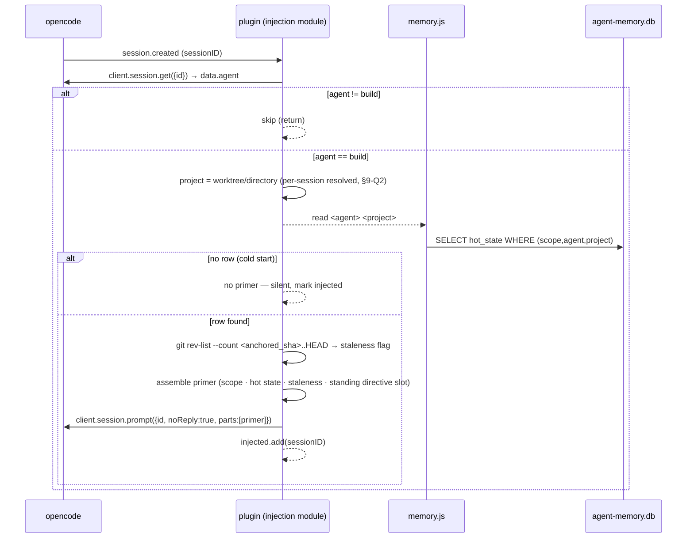

# Agent Memory Subsystem — Runtime Architecture

Status: **Design (Phase 1)** · Scope: `build` agent only · Owner of this doc: `architect` · Implementer: `build`

This is the single canonical design document for the opencode "persistent agent
memory" subsystem. It is implementation-ready but **lean**: it fixes the
component boundaries, data flow, storage schema, failure behaviour, and the exact
opencode integration points. It deliberately does **not** contain full source; a
short signature, schema fragment, or event name shown here is an example, not the
implementation. The `build` agent implements from it.

---

## 1. Problem & goal

A user works tasks in opencode across sessions, stops without a clean wind-down,
and later resumes expecting the primary `build` agent to know exactly where they
left off — and to **confirm** that understanding before acting. Today that
context is lost. This subsystem captures work continuously and cheaply during a
session, distils it once when the session goes idle, and auto-loads a small,
reconciled primer at the start of any new `build` session in the same project.

The design is bound by the locked decisions in the task brief (injection
mechanism, hot/cold storage split, capture cadence, primer content slots, and
`build`-only Phase-1 scope). Those are treated as given constraints, not
re-litigated. Where a locked decision leaves a platform question open, it is
carried into **§9 Open platform questions**.

### Reliability disciplines honoured

- **Reconciliation-on-read** — stored memory is a *hypothesis*, re-verified against
  git/HEAD before use via a SHA-diff staleness flag (§4, §Git helper).
- **Relevance scoping / context-rot control** — only tiny structured hot state is
  injected; the cold "why" (ADRs) is referenced by path, never auto-injected.
- **Teach-back** — the primer's standing directive makes resume end in a
  *confirmation question*, not an autonomous action (prose owned by `agent-engineer`).
- **Structured, parseable schema** — one explicit single next-action handoff.

---

## 2. Design constraints inherited from the reference plugin

The existing `opencode-session-review` plugin (`.config/opencode/plugins/opencode-session-review/`)
is the proven template for robustness and is mirrored throughout:

- **Sole-writer CLI.** A standalone Node CLI (`memory.js`, spawned via `$`) is the
  **only** process that opens the SQLite DB for writing. The plugin never opens
  the DB directly. Process-level isolation + `PRAGMA busy_timeout` handles
  concurrency (as in `src/lib/db.js`).
- **Fail-safe everywhere.** Every step is wrapped in try/catch; any failure degrades
  to "no capture / no injection" for that session and **never throws into opencode**.
- **In-flight guard + serialized queue.** An in-flight `Set` collapses duplicate
  events for a session whose work is still pending; a single serialized promise
  chain prevents overlapping captures (as in `src/plugin.js`).
- **Watermark + throttle.** A per-session watermark and a min-interval throttle
  (default `60000` ms via env) make re-processing on re-idle correct and cheap
  (as in `src/lib/watermark.js`).
- **Small-model via ephemeral sub-session.** A background model call is made by
  `client.session.create()` then `client.session.prompt({ agent, parts })`, and the
  reply parts are parsed as JSON — exactly the `runDedup()` pattern.
- **Runtime-dependency-free.** Uses Node built-in `node:sqlite` (Node ≥ 22.5); no
  npm runtime deps (jest is dev-only). `"type":"module"`,
  `engines.node >=22.5`, `peerDependencies["@opencode-ai/plugin"] >=1.15.0`.

---

## 3. Component breakdown

New plugin package: `.config/opencode/plugins/opencode-agent-memory/`.

```mermaid
flowchart TB
  subgraph OC[opencode host process]
    EV[opencode events\nsession.created / idle / file.edited /\ntodo.updated / message.updated]
  end

  subgraph PLUGIN[opencode-agent-memory plugin  (src/plugin.js)]
    ROUTER[1. Event router\n+ in-flight guard\n+ serialized queue]
    ACC[2. Continuous signal accumulator\n(in-memory buffer, no LLM)]
    IDLE[3. Idle-distil worker\n(throttle + watermark)]
    INJ[4. Injection module\n(session.created / fallback)]
    GIT[6. Git reconciliation helper\n( $ git rev-parse / rev-list )]
  end

  DISTILLER[[memory-distiller subagent\nsmall model, JSON-only\nregistered by agent-engineer]]

  subgraph CLI[memory.js CLI  — SOLE DB WRITER  (spawned via $)]
    STORE[5. SQLite store module\n(node:sqlite)]
  end

  DB[(agent-memory.db\n~/.local/share/opencode/)]
  ADR[/repo docs/adr/*.md\nwritten by the agent, never the plugin/]

  EV --> ROUTER
  ROUTER --> ACC
  ROUTER --> IDLE
  ROUTER --> INJ
  ACC -->|throttled flush| CLI
  IDLE -->|prior state + signals| DISTILLER
  DISTILLER -->|structured JSON| IDLE
  IDLE --> GIT
  IDLE -->|write hot state + prune scratch| CLI
  INJ --> GIT
  INJ -->|read latest hot state| CLI
  INJ -->|primer via client.session.prompt noReply| EV
  CLI <--> DB
  ADR -. referenced by path/id only .-> DB
```

| # | Component | Responsibility | Boundary (what it must NOT do) |
|---|-----------|----------------|-------------------------------|
| 1 | **Event router** | Single `event` hook. Dispatches by `event.type`; owns the in-flight `Set`, the serialized promise queue, the `MAX_IN_FLIGHT` cap, and the per-process `injected` `Set`. | No business logic, no DB, no model calls inline. Never throws. |
| 2 | **Continuous signal accumulator** | On `file.edited` / `todo.updated` / `message.updated` for a `build` session, update an in-memory per-session buffer (touched-file set, todo delta, last-message ms). Cheap, deterministic, **no LLM**. Flush to the scratch table via the CLI on a throttle. | No LLM. No hot-state writes. No repo writes. |
| 3 | **Idle-distil worker** | On `session.idle`: flush remaining signals, invoke the distiller subagent once (throttled), anchor to current HEAD, write hot state via the CLI. May set an `adr_candidate` flag. | Never writes the DB directly, never writes an ADR file, never distils more than once per throttle window. |
| 4 | **Injection module** | On `session.created` (+ fallback, §4) for a `build` session: resolve agent+project, read latest hot state, compute staleness, assemble the primer, inject exactly once via `client.session.prompt({ noReply:true })`. | One injection per session. No DB writes. Silent when no memory exists. |
| 5 | **SQLite store module** (`memory.js`) | Sole DB writer/reader. Subcommands: `accrue`, `distil-write`, `read`, `init`, `prune`. Idempotent schema creation; UPSERT with monotonic `updated_at` guard. | It is a pure CLI: no model calls, no repo writes, no opencode `client`. |
| 6 | **Git reconciliation helper** | Wrap `$ git -C <project> rev-parse HEAD` and `$ git -C <project> rev-list --count <sha>..HEAD`. Return `{ head, distance, status }` where `status ∈ {ok, no-git, diverged}`. | Read-only git. Never mutates the repo. Never throws. |

The **distiller subagent** (`memory-distiller`) is a pure text→JSON function
(prior hot state + accrued signals → distilled hot state). It has no tools and
never touches the DB — it is invoked by component 3 via an ephemeral session and
its model is set in `opencode.jsonc` (see §10). Its registration is an
agent-definition change and is therefore owned by `agent-engineer`, not written here.

---

## 4. Data flow

### 4.1 Capture → distil → store (during a session)

```mermaid
sequenceDiagram
  participant OC as opencode
  participant P as plugin (router/acc/idle)
  participant CLI as memory.js (sole writer)
  participant M as memory-distiller (small model)
  participant DB as agent-memory.db

  Note over OC,P: build session, active work
  OC->>P: file.edited / todo.updated / message.updated
  P->>P: update in-memory buffer (no I/O, no LLM)
  P-->>CLI: (throttled) accrue <sessionID> <agent> <project>  ← buffer delta on stdin
  CLI->>DB: INSERT INTO memory_signal (...)

  OC->>P: session.idle (build session)
  P->>P: in-flight guard + queue + watermark/throttle
  P-->>CLI: read <agent> <project> (prior hot state) + pull scratch
  CLI-->>P: prior hot state JSON + accrued signals JSON
  P->>M: create ephemeral session + prompt(agent=memory-distiller, parts=distil prompt)
  M-->>P: {last_worked_summary, next_action, open_questions[], adr_candidate?}
  P->>P: git rev-parse HEAD  (anchor)
  P-->>CLI: distil-write <agent> <project>  ← distilled JSON + anchored_sha on stdin
  CLI->>DB: UPSERT hot_state (updated_at guard); DELETE consumed memory_signal rows
```

### 4.2 Session start → inject (on the next session)



**Fallback trigger (resume ambiguity).** If `session.created` does *not* fire for a
resumed/continued session (open platform question, §9-Q1), the injection module
also inspects the *first* qualifying event (`message.updated` / `session.idle`) for
a `build` session that this plugin process has not yet primed, and injects then —
guarded by the same per-process `injected` `Set` so a session is primed **at most
once per process lifetime**. Because hot state is keyed by `(agent, project)` and
**not** by `sessionID`, any new session in that project for `build` receives the
latest memory regardless of which trigger fires.

---

## 5. SQLite schema

DB file: **`~/.local/share/opencode/agent-memory.db`** (override via `AGENT_MEMORY_DB`).
Created idempotently by `memory.js init` (`CREATE TABLE IF NOT EXISTS`), mirroring
`src/lib/schema.js`. `node:sqlite` has no array/JSON column type, so list fields
are stored as JSON `TEXT`.

```sql
-- Hot state: one row per (scope, agent, project). The (agent, project) key is the
-- Phase-1 identity; `scope` is present now so 'global' and other agents are a
-- non-breaking additive extension later (Phase-1 rows are all scope='project').
CREATE TABLE IF NOT EXISTS hot_state (
  id                  INTEGER PRIMARY KEY AUTOINCREMENT,
  scope               TEXT    NOT NULL DEFAULT 'project',   -- 'project' | (future) 'global'
  agent               TEXT    NOT NULL,                     -- 'build' in Phase 1
  project             TEXT    NOT NULL,                     -- worktree abs path ('' reserved for scope='global')
  last_worked_summary TEXT,                                 -- short free text
  next_action         TEXT,                                 -- THE single explicit next action
  open_questions      TEXT,                                 -- JSON array of strings
  adr_candidate       TEXT,                                 -- nullable: flagged unrecorded decision ("consider ADR")
  anchored_git_sha    TEXT,                                 -- HEAD at distil time (nullable: no-git)
  schema_version      INTEGER NOT NULL DEFAULT 1,
  updated_at          INTEGER NOT NULL,                     -- epoch ms
  UNIQUE (scope, agent, project)
);
CREATE INDEX IF NOT EXISTS idx_hot_state_lookup ON hot_state (agent, project, scope);

-- Continuous deterministic signal scratch. Written cheaply during a session,
-- consumed (folded into hot_state) and pruned at idle-distil time.
CREATE TABLE IF NOT EXISTS memory_signal (
  id          INTEGER PRIMARY KEY AUTOINCREMENT,
  session_id  TEXT    NOT NULL,
  scope       TEXT    NOT NULL DEFAULT 'project',
  agent       TEXT    NOT NULL,
  project     TEXT    NOT NULL,
  kind        TEXT    NOT NULL,   -- 'file' | 'todo' | 'message'
  payload     TEXT    NOT NULL,   -- file path | todo-delta JSON | message marker
  created_at  INTEGER NOT NULL    -- epoch ms
);
CREATE INDEX IF NOT EXISTS idx_signal_scope   ON memory_signal (agent, project, session_id);
CREATE INDEX IF NOT EXISTS idx_signal_created ON memory_signal (created_at);

-- Per-session distil watermark + throttle (mirror of capture_watermark).
CREATE TABLE IF NOT EXISTS distil_watermark (
  session_id     TEXT    PRIMARY KEY,
  last_signal_ms INTEGER NOT NULL DEFAULT 0,   -- highest signal ms folded so far
  last_distil_ms INTEGER NOT NULL DEFAULT 0    -- last non-throttled distil (epoch ms)
);
```

Notes:
- **No injection-tracking table.** "Inject at most once" is enforced by the
  in-memory per-process `injected` `Set`; a new opencode process *should* re-inject
  (that is the resume path), so persisting it would be wrong.
- **Monotonic write guard.** `distil-write` UPSERTs with
  `... ON CONFLICT(scope,agent,project) DO UPDATE SET ... WHERE excluded.updated_at > hot_state.updated_at`
  so two racing idle distils for the same project cannot regress the row.
- **Future scopes are additive.** Adding `scope='global'` or another agent adds
  rows, never columns — no migration, satisfying the Phase-1 non-breaking rule.

---

## 6. The `session.created` injection sequence (detail)

1. **Trigger.** `event.type === 'session.created'`; read `event.properties.sessionID`.
2. **Resolve agent.** `client.session.get({ path:{ id } })` → `data.agent`. On error, skip (fail-safe).
3. **Filter to `build`.** If `agent !== 'build'`, return. (Cheap, before any DB/git.)
4. **Resolve project.** Use the session's worktree/`directory` (§9-Q2 covers the
   per-session vs construction-time resolution risk). This is the `project` key.
5. **Read hot state.** `memory.js read build <project>` → JSON row or empty.
6. **Cold start.** No row → **no injection**, silently mark the session primed and return.
7. **Compute staleness.** Git helper: `rev-list --count <anchored_sha>..HEAD`.
   - `ok` → `"N commits since this note — reconcile before trusting"` (N may be 0).
   - `no-git` → `"git anchor unavailable — verify against current code"`.
   - `diverged` (sha unreachable, e.g. rebase/force-push) → `"history diverged since this note — reconcile before trusting"`.
8. **Assemble primer** from structured slots (prose owned by `agent-engineer`; this
   design supplies only the slots and their order):
   - scope line — `project` + `agent`;
   - hot state — `last_worked_summary`, **the** `next_action`, `open_questions`;
   - `adr_candidate` line if set (points at cold "why", by reference);
   - the staleness flag from step 7;
   - a standing **teach-back directive** slot: on resume, replay understanding of
     next-action + open-questions and get user confirmation **before** acting,
     treating memory as a hypothesis to verify against current code.
9. **Inject once.** `client.session.prompt({ path:{ id }, body:{ noReply:true, parts:[{ type:'text', text: primer }] } })`;
   then `injected.add(sessionID)`. Stable API only — **no** `experimental.chat.system.transform`.

The primer is kept intentionally small (hot state only) for context-rot control;
cold ADRs are referenced, never inlined.

---

## 7. The idle-distil worker (detail)

- **Trigger.** `event.type === 'session.idle'` for a `build` session.
- **Guards (mirrored from the reference).** In-flight `Set` collapses duplicate
  idles for a still-pending session; the serialized queue prevents overlap; the
  `MAX_IN_FLIGHT` cap sheds load; the watermark + `DISTIL_MIN_INTERVAL_MS`
  (default `60000`, env-overridable) throttles re-distil on re-idle. A distil is
  skipped (watermark advanced only) if within the throttle window and no new signals.
- **Small-model invocation boundary — chosen mechanism.** Component 3 spawns an
  **ephemeral session** and prompts a dedicated cheap subagent, exactly like the
  reference `runDedup()`:
  `client.session.create({ body:{ title:'agent-memory distil' } })` →
  `client.session.prompt({ path:{ id }, body:{ agent:'memory-distiller', parts:[distilPrompt] } })`
  → parse the reply parts as strict JSON. The subagent's model is `small_model`
  (`gpt-5-mini`) set in `opencode.jsonc` (§10).
  - *Options considered:* (a) `experimental.session.compacting` — rejected: it is
    compaction-triggered, not idle-triggered, and experimental. (b) a direct model
    API — rejected: not exposed to plugins through `client`. (c) ephemeral
    sub-session — **chosen**: it is the only stable, already-proven path, runs in the
    background off the user's turn, and returns parseable parts synchronously.
- **Sole-writer discipline.** The model call returns **data only**. The plugin then
  calls `memory.js distil-write` (the sole writer) passing the distilled JSON plus
  the anchored SHA on stdin. The model and the plugin never open the DB; the CLI
  UPSERTs hot state and prunes the consumed `memory_signal` rows in one transaction.
- **ADR flag only.** If the distiller detects an unrecorded decision it sets
  `adr_candidate` text ("consider ADR: …"). The worker **never** writes the ADR file.
- **Fail-safe.** Model failure, timeout, or unparseable JSON → prior hot state is
  **kept**, scratch signals are **not** pruned (folded next cycle), the error is
  logged, and nothing throws into opencode.

---

## 8. Concurrency & robustness model

Directly mirrored from `opencode-session-review/src/plugin.js`:

- **In-flight `Set`** — a session is added when its idle work is queued, removed when
  it settles (in `.finally`). Collapses duplicate idles for a still-pending session;
  does **not** suppress a later idle after completion (re-distil is made correct by
  the watermark, not by dropping events).
- **Serialized promise queue** — `queue = queue.then(handle).catch(log).finally(clear)`;
  each handler awaits only *its own* link, so a burst of idle sessions does not make
  each block on every other's model round-trip.
- **`MAX_IN_FLIGHT` cap** — backpressure: beyond the cap a new idle is dropped (it
  re-fires on the session's next idle; the watermark means nothing is lost).
- **Watermark + throttle** — `distil_watermark` + `DISTIL_MIN_INTERVAL_MS` make
  re-distil on re-idle cheap and non-duplicating.
- **`injected` `Set`** — per-process idempotency for injection (session.created +
  fallback trigger both consult it).
- **`busy_timeout`** — `memory.js` opens the DB with `PRAGMA busy_timeout = 5000`
  so concurrent CLI processes wait for the lock instead of failing.

---

## 9. Failure modes & safe degradation

| Failure | Detection | Degradation (never throws into opencode) |
|---|---|---|
| **git absent / not a repo** | `rev-parse` exits non-zero | `anchored_git_sha = NULL`; staleness = `no-git`; hot state still written/injected without an anchor. |
| **anchored SHA unreachable** (rebase/force-push) | `rev-list --count` fails | staleness = `diverged` ("reconcile before trusting"); primer still injected. |
| **DB locked** | CLI non-zero after `busy_timeout` | plugin catches, logs, no-op for this cycle; retried next event/idle. |
| **model call fails / times out** | thrown from `client.session.prompt` | keep prior hot state, keep scratch, log; no distil this cycle. |
| **model returns unparseable / partial JSON** | JSON parse / schema check fails | reject, keep prior hot state (as `parseDedupReply` tolerance); log. |
| **`session.created` not fired on resume** | no primer by first event | fallback inject on first qualifying event, guarded by `injected` `Set` (§4, §9-Q1). |
| **no memory yet (cold start)** | empty `read` result | no injection, silent; session proceeds normally. |
| **concurrent idle distils, same project** | two writers race | serialized queue + monotonic `updated_at` UPSERT guard; older write is a no-op. |
| **subprocess storm from high-frequency `file.edited`** | many events | accumulator buffers in memory; DB flush is throttled → bounded subprocess count. |
| **plugin/opencode crash before idle** | buffered signals lost | acceptable: best-effort; next session re-accrues. Persisted scratch (throttled flush) bounds the loss. |
| **ephemeral distil sessions accumulate** | grows over time | optional cleanup via `client.session.delete` if available (§9-Q4); non-fatal if skipped. |

### Open platform questions / risks (verify during build)

| # | Question / risk | Recommended resolution |
|---|---|---|
| **Q1** | Does `session.created` fire on **resumed/continued** sessions, or only brand-new ones? | Key memory by `(agent, project)` (done). Add the first-qualifying-event fallback inject (§4), guarded by the `injected` `Set`. Verify empirically with a temporary event-logging probe during build; if `session.created` reliably fires on resume, the fallback is a harmless safety net. |
| **Q2** | Is the plugin's construction-time `worktree`/`directory` guaranteed to equal each session's project, or can one plugin instance serve multiple worktrees? | Prefer **per-session** project resolution from the session/event data; fall back to construction-time `worktree`. Verify whether the plugin is instantiated per-worktree; if so, construction-time `worktree` is sufficient. |
| **Q3** | Can `client.session.prompt({ agent })` reliably run a *specific small model* in the background and return parseable parts? | Proven by `runDedup()` in session-review — reuse verbatim. Verify the `memory-distiller` agent is registered (§10) before first distil; on missing agent, degrade to no distil. |
| **Q4** | Do ephemeral distil sessions need cleanup, and is `client.session.delete` available? | Low priority. If available, delete the ephemeral session after parsing; otherwise leave (non-fatal). Confirm against the running `@opencode-ai/plugin` version. |
| **Q5** | Is a session ready to accept `client.session.prompt(noReply:true)` at `session.created` time (no init race)? | Verify ordering during build. If a race exists, move the primary injection to the first `message.updated`/`session.idle` for an un-primed session (the fallback path already handles this), keeping `session.created` as an optimisation. |
| **Q6** | `git rev-list --count` behaviour when the anchor SHA is not an ancestor of HEAD. | Treat any non-zero/parse failure as `diverged` (not `ok` with a bogus count). Covered in the Git helper contract (§3, component 6). |

---

## 10. Config / permission wiring (`opencode.jsonc` + repo)

Two mechanical wiring changes and one agent-definition change:

1. **Plugin package (auto-discovery).** Create
   `.config/opencode/plugins/opencode-agent-memory/` (mirroring the session-review
   layout: `src/plugin.js`, `src/memory.js`, `src/lib/*`, `package.json`,
   `test/`). opencode auto-discovers `*.js` **files directly inside** `plugins/`, so
   registration is a **symlink**, not an `opencode.jsonc` `plugin` array entry:
   `plugins/opencode-agent-memory.js → opencode-agent-memory/src/plugin.js`.
   This symlink is created by the bootstrap/update machinery — extend
   `scripts/lib.sh` (the same place that creates `plugins/opencode-notify.js`).
   *(This is an `agent-dotfiles` code/script change for `build`, not an agent-instruction change.)*
2. **No `opencode.jsonc` `plugin` array entry and no permission grant for the plugin.**
   opencode plugins run in the host process, outside the per-agent tool-permission
   sandbox, so the plugin's `$` git/`node` subprocesses need no permission rule. The
   only `opencode.jsonc` edit is the distiller agent model binding below.
3. **`memory-distiller` subagent registration** — a new cheap, JSON-only subagent
   bound to the small model, e.g.:
   ```jsonc
   // in opencode.jsonc "agent" block
   "memory-distiller": {
     "model": "github-copilot/gpt-5-mini" // cheap, high-frequency structured-JSON distillation
   }
   ```
   Defining/registering an agent is an **agent-definition change** and is therefore
   owned by **`agent-engineer`**, not by `architect` or `build`. This design only
   specifies the slot; `agent-engineer` authors the agent definition and its prompt
   (and the primer prose referenced in §6/§8).
4. **Exclusions.** Add `memory-distiller` to the session-review plugin's
   `EXCLUDED_AGENTS` (recursion/noise guard), and ensure the memory subsystem only
   ever targets `agent === 'build'` (already enforced in §6).

---

## 11. ADR convention (cold "why")

- **Location.** `docs/adr/` in the **working repo** the `build` agent is operating in
  (not necessarily `agent-dotfiles`).
- **Filename.** Zero-padded sequential kebab-case: `NNNN-short-title.md`
  (e.g. `0001-hot-state-in-sqlite.md`).
- **Template (Nygard).** `# Title` · **Status** (Proposed / Accepted / Superseded
  by NNNN) · **Context** · **Decision** · **Consequences**.
- **Boundary (non-negotiable).** The **agent writes ADRs** during normal work using
  its ordinary edit tools, and they are committed to the repo like any source file.
  The **plugin never writes repo files** and remains the sole writer of the SQLite
  DB only. The idle-distil may *flag* an unrecorded decision by setting
  `hot_state.adr_candidate` ("consider ADR: …"), surfaced in the next primer — but it
  never creates the ADR. Cold artefacts are **referenced by path/id**, never
  auto-injected as primer content.

---

## 12. Component / work breakdown (for `build`)

No agent is assigned per item; `build` implements each, loading the matching skill.
This is a design artefact, not a task/sprint plan.

| Part | Work kind | Done-criterion |
|---|---|---|
| `opencode-agent-memory` package scaffold (`package.json`, layout, jest) | Application code (Node/ESM) | Mirrors session-review manifest; `node --experimental-vm-modules` jest runs green; zero runtime deps. |
| `memory.js` CLI + `src/lib/*` (schema, db, watermark, store) — **sole writer** | Application code | `init`/`accrue`/`read`/`distil-write`/`prune` subcommands work against `agent-memory.db`; schema per §5; monotonic UPSERT guard verified by test. |
| `src/plugin.js` — event router, accumulator, idle-distil, injection, git helper | Application code | All hooks in §3–§8 implemented; fail-safe (no throw into opencode) covered by tests; concurrency guards mirror the reference. |
| Distiller prompt builder + strict JSON parser (`src/lib/distil-prompt.js`) | Application code | Produces the distil prompt from prior state + signals; tolerant parser rejects malformed JSON and preserves prior state. |
| Auto-discovery symlink wiring in `scripts/lib.sh` (+ bootstrap/update call) | Shell / build tooling | `make bootstrap` and `make update` create/verify `plugins/opencode-agent-memory.js`; idempotent. |
| `opencode.jsonc` `memory-distiller` model binding + session-review `EXCLUDED_AGENTS` update | Config (JSONC) | Distiller bound to `gpt-5-mini`; distiller excluded from session-review capture. |
| **`memory-distiller` agent definition + primer prose slots** | **Agent-instruction change — route to `agent-engineer`** | Out of scope for `build`/`architect`: the agent definition and the §6/§8 primer wording are authored by `agent-engineer`. |
| Tests: schema/UPSERT, watermark/throttle, in-flight/queue, git-helper statuses, fail-safe degradations, cold-start no-inject | Application code (jest) | Each failure row in §9 has a test; injection idempotency and `(agent,project)` keying covered. |
| Package `README.md` (install, env vars, CLI reference) | Documentation | Documents `AGENT_MEMORY_DB`, `DISTIL_MIN_INTERVAL_MS`, subcommands, and the symlink wiring. |

---

## 13. Environment variables

| Var | Default | Purpose |
|---|---|---|
| `AGENT_MEMORY_DB` | `~/.local/share/opencode/agent-memory.db` | Hot-state + scratch DB path. |
| `DISTIL_MIN_INTERVAL_MS` | `60000` | Idle-distil throttle window. |
| `MEMORY_FLUSH_INTERVAL_MS` | `60000` | Continuous-accrual scratch flush throttle. |
| `MEMORY_TARGET_AGENT` | `build` | Phase-1 target agent (single value; the scope column already allows widening later). |

## Future Enhancements

- **Make the distiller model configurable via a JSONC file in the opencode config directory.** The inline distiller model is currently pinned by the `MEMORY_DISTILLER_MODEL` plugin env var (default `github-copilot/gpt-5-mini`). A future enhancement should let the plugin read its model choice from a dedicated, plugin-owned JSONC file under the opencode config directory (`~/.config/opencode/`) — **not** the central `opencode.jsonc` itself — so the model can be set as configuration rather than an environment variable while keeping the plugin's settings separate from opencode's own config.
