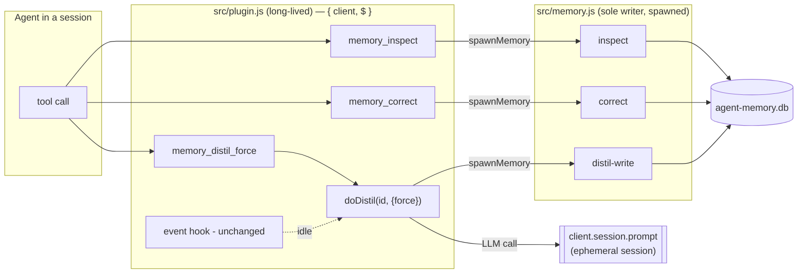

## Context

`opencode-agent-memory` is a Node.js opencode plugin with a strict two-process split:

- **`src/memory.js`** — the *sole* SQLite writer, a short-lived CLI spawned as a
  subprocess. Subcommands today: `init`, `accrue`, `read`, `distil-write`, `prune`.
  The `distil-write` UPSERT carries a **monotonic guard**
  (`excluded.updated_at > hot_state.updated_at`) so racing idle distils cannot regress
  the row.
- **`src/plugin.js`** — the long-lived `AgentMemory` factory (default export). It
  receives `{ client, $ }`, **never opens the DB directly**, and reaches all state
  through `spawnMemory($, [...])`. It currently returns a single `event` hook and owns
  the in-process idle-distil worker `doDistil(sessionId)`, which needs `client` to
  create an ephemeral session and call the LLM.

Today an agent has no runtime control over its own memory: it can only wait for the
idle-distil cycle or reach for low-level DB operations. The change adds three
capabilities — **inspect** (read `hot_state` + pending signals, non-destructive),
**correct** (patch a wrong fact in `hot_state`), and **distil-force** (immediate
distillation, bypassing the idle throttle).

**Verified precondition (was an open question in the proposal).** The proposal treated
plugin-registered tools as possibly-unsupported. This is now settled from the installed
package types and runtime JS: `@opencode-ai/plugin@1.17.13` (peer dep `>=1.15.0`)
exposes `Hooks.tool?: { [key]: ToolDefinition }`. A tool's `execute(args, context)`
runs **inside the factory closure** (so it has `client` and `$`) and its `ToolContext`
supplies `sessionID`, `agent`, and `directory` for free. `tool()` is an identity
helper and `tool.schema` is zod (already present transitively — no new dependency).
This fact overturns the proposal's assumption and reshapes the answer to how these
capabilities are best exposed. Recorded as `global/reality/opencode-plugin-tool-registration`.

## Goals / Non-Goals

**Goals:**

- Give agents first-class, in-session control over memory: read it, correct a specific
  wrong fact, and force an immediate distillation.
- Preserve every existing invariant: the plugin never opens the DB; the `distil-write`
  monotonic guard stays intact; the idle-distil throttle, `prune`, and env-var config
  are untouched; the `AgentMemory` default-export contract does not break.
- Fail safe: a new operation degrades to an informative result and never propagates an
  exception into the opencode host.
- Add no new npm dependency and no schema change.

**Non-Goals:**

- No new tables or columns; operations run on the existing `hot_state` / `memory_signal`
  tables.
- No change to how signals are captured, throttled, or pruned.
- No optimistic-concurrency / compare-and-swap protocol for corrections (see YAGNI
  rejections).
- No cross-worktree attribution fixes or other pre-existing Phase-1 limitations.
- No multi-scope management surface — operations target the same `(scope='project',
  agent, project)` key the plugin already uses.

## Decisions

### D1 — Exposure: layered hybrid (data plane in the CLI, control plane as plugin tools)

The three capabilities split cleanly across the two existing processes rather than being
forced into one.

**Options considered**

| Option | Shape | Verdict |
|---|---|---|
| A — CLI-only | `inspect`/`correct`/`distil-force` all as `memory.js` subcommands; agent invokes via shell | **Rejected.** `distil-force` needs `client` (LLM); a CLI subprocess has none, forcing a fragile IPC hack back to the plugin. |
| B — Tools-only | All three as registered plugin tools | **Rejected as sole mechanism.** `inspect`/`correct` still must reach the DB through `memory.js` (sole-writer invariant), so a CLI layer exists regardless; hiding it loses a scriptable, unit-testable data primitive. |
| **C — Hybrid (recommended)** | `memory.js` gains `inspect` + `correct` subcommands (data plane); plugin registers three tools (control plane) | **Chosen.** Each capability implemented once at its correct layer. |

**Recommendation — C.** `memory.js` grows two pure-DB subcommands (`inspect`,
`correct`) that preserve the sole-writer invariant and remain independently scriptable
and testable. The plugin gains a `tool` hook exposing three agent-facing tools:

- `memory_inspect` → `spawnMemory($, ['inspect', TARGET_AGENT, directory])`.
- `memory_correct` → `spawnMemory($, ['correct', TARGET_AGENT, directory, patchJson])`.
- `memory_distil_force` → calls the in-process `doDistil` directly (needs `client`).

**Scope resolution (refined — see Review R2).** All three tools resolve the **agent**
dimension to `TARGET_AGENT`, not `ToolContext.agent`. The store is single-agent: every
row `doDistil` writes is keyed `agent = TARGET_AGENT` (it early-returns for any other
agent), so a tool keyed on the *caller's* agent would read/write a different, usually
empty scope than the one `distil-force` writes — breaking the "correction and force write
the same key" invariant asserted in D2. Only the **project** dimension comes from
`ToolContext.directory`.

The plugin's returned object simply gains a `tool: { … }` key next to `event`; the
default export is unchanged, so the load contract holds. There is deliberately **no
`memory.js distil-force` subcommand** — it is impossible without `client` and would only
reintroduce IPC.

### D2 — `distil-force`: an in-process tool that reuses `doDistil`, bypassing only the throttle

**Options considered (proposal Q2)**

- **A — Plugin-level (recommended).** A registered tool calls `doDistil(context.sessionID, { force: true })`.
- B — Sentinel session: CLI creates a specially-titled session the plugin detects. Fragile IPC.
- C — Message-content trigger via `message.updated`. Fragile, couples to message text.

**Recommendation — A.** With tool registration verified, B and C were only ever
workarounds for an unavailable in-process entrypoint — that entrypoint now exists.
`ToolContext.sessionID` identifies the caller's session; `execute` reuses the exact
`doDistil` path (buffer flush → `accrue` → ephemeral session → LLM → `distil-write`).

`doDistil` is parameterised as `doDistil(sessionId, { force = false } = {})`. The `force`
flag skips **only** the throttle early-return (current lines guarding
`now - lastDistilMs < DISTIL_MIN_INTERVAL_MS`); every other step — ephemeral-session
guard, agent/project resolution via `session.get`, signal reduction, monotonic
`distil-write` — is identical. The idle path calls `doDistil(id)` unchanged, so its
60-second throttle behaviour is provably untouched. Forced distils resolve scope the
same way the idle path does, so a correction and a force write to the same
`(agent, project)` key.

### D3 — `correct`: partial patch-merge, not full rewrite (proposal Q3)

**Recommendation — B (patch merge).** The stated goal is "fix a specific wrong fact".
`correct` accepts only the fields to change and merges them onto the current row inside a
single transaction: **read current `hot_state` → overlay supplied fields → UPSERT**.
Full rewrite (Option A) was rejected: it forces the caller to `inspect`-then-reconstruct
the whole object, opening a lost-update window and clobbering fields the caller never
intended to touch.

Details that keep this safe and minimal:

- The merge base is the existing row; if no row exists, the base is `EMPTY_RECORD`
  (already defined in `distil-prompt.js`), so `correct` is well-defined even cold and can
  bootstrap a row.
- Mergeable fields are the four distilled keys (`last_worked_summary`, `next_action`,
  `open_questions`, `adr_candidate`) plus optionally `anchored_git_sha`; anything not
  supplied is preserved. Field types are validated with the same shape checks
  `parseDistilReply` already applies.
- `correct` **must not** delete signals or advance any watermark — unlike `distil-write`,
  it is a pure `hot_state` patch. It reuses `distil-write`'s UPSERT statement but skips
  the signal-delete and watermark-advance steps.

### D4 — `correct` `updated_at`: `current_updated_at + 1`, computed inside the transaction (proposal Q4)

**Options considered**

- A — `Date.now()`: races a near-simultaneous idle distil, and within the same
  millisecond the strict `>` guard can silently **drop** the correction. **Rejected.**
- C — `Date.now()` + a `force` flag that skips the guard: a correction based on a stale
  `inspect` could regress a genuinely newer distil. **Rejected** (defeats the guard's purpose).
- **B — `current_updated_at + 1` (recommended).**

**Recommendation — B.** Because `correct` performs read-merge-write in **one
transaction**, the row it reads is the row it writes. It sets
`updated_at = current_updated_at + 1`, which is strictly greater than the row it merged
from, so the existing monotonic-guard UPSERT (kept verbatim for defence-in-depth) always
passes. This is deterministic and free of any wall-clock dependency.

The proposal's Q4 race fear is dissolved by an invariant already present in the system:
`memory.js` is the **sole writer**, each invocation is a short-lived process, and SQLite
(WAL + `busy_timeout=5000`) **serialises** writer transactions — **provided `correct`
opens its transaction with `BEGIN IMMEDIATE`** (refined — see Review R1). Because
`correct` reads before it writes, a default deferred `BEGIN` takes its read snapshot at
the `SELECT`; if a concurrent `distil-write` commits before `correct`'s UPSERT, the
write-upgrade fails with `SQLITE_BUSY_SNAPSHOT`, which `busy_timeout` does **not** retry
(a snapshot conflict is not a lock wait). `BEGIN IMMEDIATE` takes the write lock up front
— `busy_timeout` then applies to acquiring it — so the SELECT reads the latest committed
row and no other writer can interleave. A `correct` transaction and a `distil-write`
transaction therefore cannot interleave — whichever starts second
reads the other's committed `updated_at` and writes a strictly larger value. The result
is monotonic in every ordering: no regression, no lost correction, and no reliance on
skipping the guard. This satisfies the constraint that the guard remains intact.
(`distil-write` itself is safe with the existing deferred `BEGIN` because its first
in-transaction statement is the UPSERT write, so it never holds a stale read snapshot.)

### Architecture (control plane / data plane)



Control flow of a correction (single serialised writer transaction):

```mermaid
sequenceDiagram
    participant Ag as Agent
    participant Tl as memory_correct (plugin)
    participant CLI as memory.js correct
    participant DB as SQLite (serialised writer)
    Ag->>Tl: patch { next_action: "..." }
    Tl->>CLI: spawnMemory(['correct', agent, dir, patch])
    Note over CLI,DB: BEGIN IMMEDIATE (write lock up front; busy_timeout serialises vs distil-write)
    CLI->>DB: SELECT current hot_state row
    CLI->>CLI: merge patch onto row (unset fields preserved)
    CLI->>DB: UPSERT updated_at = current+1 (guard passes)
    Note over CLI,DB: COMMIT — no signal delete, no watermark advance
    CLI-->>Tl: ok
    Tl-->>Ag: ToolResult (never throws into host)
```

### Component breakdown (work-kind + done-criterion; no agent assigned, no sequencing)

1. **`memory.js inspect` subcommand** — *application code (CLI)*. Done when
   `node memory.js inspect <agent> <project>` prints `{ prior, signals }` JSON, performs
   no writes, and reuses the existing `read` queries minus the session watermark.
2. **`memory.js correct` subcommand** — *application code (CLI)*. Done when
   `node memory.js correct <agent> <project> <patchJson>` reads, merges, and UPSERTs
   `hot_state` in one `BEGIN IMMEDIATE` transaction with `updated_at = current+1`,
   preserves unset fields, deletes no signals, advances no watermark, and rejects
   malformed field types.
3. **`doDistil` force parameter** — *application code (plugin)*. Done when
   `doDistil(id, { force })` bypasses only the throttle early-return and the idle path's
   throttle behaviour is unchanged (regression-tested).
4. **Plugin `tool` hook with three tools** — *application code (plugin)*. Done when the
   returned `Hooks` object exposes `tool: { memory_inspect, memory_correct,
   memory_distil_force }` alongside `event`; each tool resolves the agent dimension to
   `TARGET_AGENT` (project from `ToolContext.directory`); each `execute` catches all
   errors and returns a `ToolResult`; the default export is unchanged.
5. **Tests** — *application code (test)*. Done when new subcommand tests, tool-`execute`
   tests, and an idle-throttle-unchanged regression test are green.
6. **Docs** — *documentation*. Done when the README documents the three tools and two new
   CLI subcommands, and notes `distil-force` has no CLI form.

## Risks / Trade-offs

- **Tool import at plugin load.** The plugin does not currently import from
  `@opencode-ai/plugin`. `import { tool } from '@opencode-ai/plugin'` resolves in the
  installed package, but the plugin is loaded as raw ESM by opencode; the engineer should
  confirm resolution in that load context. **Mitigation:** `tool()` is an identity
  function, so a plain `{ description, args, execute }` object also works, and arg schemas
  can use `tool.schema` (zod, already transitive) — no new dependency either way.
- **Runtime tool exposure.** Type support is verified; that opencode actually surfaces a
  plugin-registered tool to a running agent's model is not yet confirmed empirically.
  **Mitigation:** the CLI data plane (`inspect`/`correct`) is independently usable via
  shell, so the capabilities are not wholly gated on tool exposure.
- **Unthrottled `distil-force` cost.** Each call spends one ephemeral session and one
  model round-trip; an agent could over-call it. **Trade-off:** accepted — invocation is
  explicit and agent-initiated, and throttling a deliberately-manual escape hatch is
  YAGNI. Revisit only if abuse is observed.
- **Stale-correction clobber.** Ordering is monotonic, but a correction issued from a
  stale `inspect` can still supersede a newer distil (it writes `current+1` on whatever it
  read). **Trade-off:** accepted; the correcting agent is the authority on the fact it is
  fixing. A compare-and-swap protocol would prevent this but is rejected below.
- **Scope resolution for `force`.** `distil-force` resolves `(agent, project)` via
  `session.get` exactly as the idle path does; if the caller's session agent differs from
  `TARGET_AGENT`, the write targets the store's configured scope rather than the caller's
  literal agent. Kept for consistency with the existing idle semantics. **Consequence
  (see Review R4):** because `doDistil` early-returns when `agent && agent !== TARGET_AGENT`,
  a `memory_distil_force` call from a session whose agent is *not* `TARGET_AGENT` is a
  **silent no-op** that still returns an "ok" `ToolResult`. `inspect`/`correct` avoid this
  by keying on `TARGET_AGENT` directly (D1, refined).
- **Forced distil advances the per-session throttle clock (see Review R3).** A forced
  distil runs the identical `distil-write` path, which calls `advanceDistilWatermark`, so
  it *does* move the session's `last_distil_ms`. This is benign — an idle distil within the
  window early-returns only when there are no new signals anyway — but it means the
  "forced distil does not affect the idle clock" phrasing is inaccurate; the true invariant
  is that the idle path's throttle *logic and interval* are unchanged.
- **Fail-safe boundary.** A tool `execute` that throws is caught by opencode's tool runner
  and returned to the agent as a tool error — acceptable and arguably desirable — but each
  `execute` still wraps its body in try/catch and returns an informative `ToolResult` so a
  failure never becomes an unhandled rejection in the host.

**YAGNI rejections (recorded):**

- **Compare-and-swap for `correct`** (caller passes expected `updated_at`): the
  sole-writer + serialised-transaction + `current+1` design already prevents *regression*;
  CAS only guards *stale-correction clobber*, at the cost of caller burden, for a race no
  concrete requirement asks to close. Rejected until such a requirement appears.
- **A `force`/guard-skip flag on `distil-write`** (proposal Q4-C): unnecessary once
  `correct` computes `current+1`; skipping the guard would reintroduce regression risk.
- **Sentinel-session / message-trigger IPC for `distil-force`** (proposal Q2-B/C):
  obsoleted by the verified in-process `tool` hook.
- **A `memory.js distil-force` subcommand** (proposal's literal Impact): impossible
  without `client`; would force fragile IPC. `distil-force` lives only as a plugin tool.
- **New schema/columns:** operations run on the existing tables.

## Review

Architectural review of this design against the current source (`src/memory.js`
`cmdRead`/`cmdDistilWrite`/dispatch, `src/plugin.js` `doDistil`/`spawnMemory`/return
shape, `src/lib/db.js`). Verdict: **sound and appropriately minimal**, with two decision
refinements applied in-place (R1, R2) and four spec/risk corrections listed below. No
decision is reversed; the hybrid split (D1), the `force`-flag reuse of `doDistil` (D2),
and patch-merge `correct` (D3) all hold.

### R1 — D4 requires `BEGIN IMMEDIATE`, not a deferred `BEGIN` (correctness, applied)

`correct` is a read-then-write transaction. The store uses `node:sqlite` `DatabaseSync`
in WAL mode with `busy_timeout=5000` (`src/lib/db.js`). With the default *deferred*
`BEGIN` (as `cmdDistilWrite` uses), the read snapshot is taken at the `SELECT`; if a
concurrent `distil-write` commits before `correct`'s UPSERT, the write-upgrade fails with
`SQLITE_BUSY_SNAPSHOT` — which `busy_timeout` does **not** retry, because a snapshot
conflict is not a lock wait. The design's "busy_timeout serialises / whichever starts
second reads the other's committed `updated_at`" claim is therefore true **only** under
`BEGIN IMMEDIATE`, which takes the write lock up front. D4, the correction sequence
diagram, and component #2 have been updated to require `BEGIN IMMEDIATE`. `distil-write`
needs no change (its first in-transaction statement is a write, so it holds no stale read
snapshot). Failure mode absent the fix is fail-safe (a caught error / non-zero exit, no
corruption or regression) but is an avoidable spurious failure under real
`correct`-vs-`distil-write` concurrency.

### R2 — Internal scope contradiction: inspect/correct keyed on caller vs force on TARGET_AGENT (applied)

As originally written, D1 keyed `inspect`/`correct` on `ToolContext.agent` while D2's
`distil-force` (via `doDistil`) writes `TARGET_AGENT`. Since the store is single-agent
(`doDistil` gates on `agent === TARGET_AGENT` and every row is `TARGET_AGENT`-keyed), a
caller whose agent ≠ `TARGET_AGENT` would inspect/correct a *different, empty* scope than
force writes — contradicting D2's own "correction and force write the same key" claim.
D1 (and component #4) now resolve the agent dimension to `TARGET_AGENT` for all three
tools; only `project` comes from `ToolContext.directory`. The tasks' ambiguous
`resolvedAgent` should be read as `TARGET_AGENT`.

### R3 — memory-distil-force spec over-claims idle-clock independence (spec change needed)

The forced distil traverses the identical `distil-write` path, which calls
`advanceDistilWatermark(sessionId, …, now)` — so it **does** advance the per-session
`last_distil_ms` that the throttle reads. The `memory-distil-force` spec's requirement
*"SHALL NOT reset or advance the idle-path throttle timer"* and its scenario *"idle-path
distil is triggered normally, unaffected by `T_force`"* are mechanically false. The
impact is benign (the compound throttle early-returns only when there are also no new
signals; genuinely new signals always bypass it), but the requirement must be reworded to
the real invariant: *the forced distil shares the per-session watermark and may advance
`last_distil_ms`; the idle path's throttle logic and `DISTIL_MIN_INTERVAL_MS` interval are
unchanged.*

### R4 — Silent no-op for a non-target-agent force caller (design + spec gap)

`memory_distil_force` → `doDistil(context.sessionID)` → `doDistil` early-returns when the
resolved session agent is not `TARGET_AGENT`. So the tool called from a non-target-agent
session does nothing yet returns success. Now acknowledged in Risks; the
`memory-distil-force` spec should add a scenario making this explicit (either an
acknowledged no-op, or a distinguishable "not the target agent" result).

### R5 — inspect spec precision (spec change needed)

`inspect` opens via `openAndInit()`, which runs `ensureSchema` (a `CREATE … IF NOT
EXISTS` write on first-ever open) and WAL churns `-wal`/`-shm`; a `SELECT` also takes a
transient read snapshot. The requirement's *"byte-for-byte identical"* and *"SHALL NOT …
lock any table"* are falsifiable. Reword to the intended guarantee: *no row is inserted,
updated, or deleted in any table* (a read-only operation with respect to row data).

### R6 — `correct` `anchored_git_sha` is unresolved across artifacts (spec change needed)

D3 lists `anchored_git_sha` as "optionally" mergeable, tasks 2.2's validation list omits
it, and the `memory-correct` spec never mentions it. Pick one: include it as a
mergeable + validated field in the spec, or drop it from D3. (`schema_version` is
hardcoded to `1` by the reused UPSERT statement — acceptable for a patch; no action.)

### Coherence notes (no change required)

- `inspect` cleanly reuses `cmdRead`'s two `(scope,agent,project)`-keyed SELECTs and drops
  the per-session watermark and the `sessionId` parameter — matches the `{ prior, signals }`
  contract. Confirmed non-destructive at the row level (subject to R5 wording).
- The "no `distil-force` CLI" guard is already satisfied: the dispatch `default:` writes the
  usage line and `process.exit(1)`. When `inspect`/`correct` land, that usage string must be
  extended to list them (but **not** `distil-force`) — see implementation notes returned to
  the engineer.
- The `force` flag correctly needs only to gate the entire compound throttle early-return
  (`!force && within-window && no-signals && buf-empty`); D2's "skips only the throttle" is
  accurate given that block already fires solely when there is nothing to fold.
