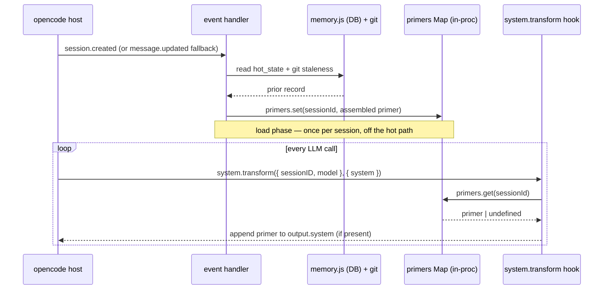

## Context

The plugin injects the memory primer by calling `client.session.prompt({ noReply: true, parts: [...] })` inside `injectPrimer`, triggered by `session.created` (with a `message.updated` fallback for resumed sessions). `noReply: true` suppresses an immediate reply, but the message is still placed in the **chat thread** and is visible to the LLM on the next turn. The assembled primer contains imperative language — a `"Next action:"` field and a closing paragraph telling the agent to "reconcile against the current code and git state … and get my confirmation first". The agent reads the primer as a user command and enters an investigation loop before the user has said anything.

The fix moves the primer out of the message register and into the **system-prompt register**, where the same text is read as background orientation rather than a directive.

### Relevant SDK surface (verified, `@opencode-ai/plugin` v1.17.15)

`experimental.chat.system.transform` is a **top-level key** on the returned `Hooks` object (a sibling of `event`, `tool`, `config` — not nested under an `experimental` object). Its shape, taken directly from `dist/index.d.ts`:

- **input:** `{ sessionID?: string; model: Model }` — note `sessionID` is **optional**, and there is **no `agent`** field.
- **output:** `{ system: string[] }` — the system-prompt fragments the host will send. The hook fires **once per LLM call** to assemble that call's system prompt; a plugin appends its fragment to `output.system`.

Two consequences of this shape drive the design and were not captured in the first draft:

1. Because there is no `agent` in the input and `sessionID` may be absent, the hook **cannot filter by target agent on its own**. Filtering has to come from what the plugin chose to cache.
2. Declaring an unsupported hook key is a **harmless no-op** — the host simply never calls an unknown key. So there is nothing to "guard" at registration time; the only failure mode of a version mismatch is *silent non-injection* (the feature degrades to off), which the observability additions below are designed to surface.

### The core structural move: decouple *load* from *inject*

Today one function both derives the primer and pushes it into the thread. The new design splits these into two independently-triggered phases, because the injection point (the system hook) fires far more often than the load point and must stay cheap:

A secondary consequence: the primer is no longer a visible chat message, so a developer can no longer scroll up to see what was injected. That observability must be restored explicitly (Goals below).

## Goals / Non-Goals

**Goals:**

- Inject the memory primer into the LLM **system prompt** via `experimental.chat.system.transform`, so it lands in the background-context register instead of the message thread.
- Rewrite the primer template (`assemblePrimer`) to passive, non-imperative framing as **defence in depth** alongside the register change (see D6).
- Restore observability lost when the primer became invisible: a server-log line on primer load, and an `active_primer` field on `memory_inspect`.

**Non-Goals:**

- No changes to the distillation path, signal accumulation, git-anchoring, or DB schema.
- No persistence of the assembled primer across process restarts — it is a session-scoped, in-process derivation; the underlying `hot_state` already lives in the DB and is re-derived on load.
- No change to the four hot-state fields' contents (only how the `next_action` field is *labelled* in the rendered primer).

## Decisions

### D1 — Inject via `experimental.chat.system.transform`

**Decision:** Register `"experimental.chat.system.transform"` on the returned hooks object. On each fire, guard, then append the cached primer to `output.system`.

**Why this over the alternatives:**

- **vs. `session.prompt({ noReply })` with reworded text (rejected):** the defect is the *register*, not the wording. Any content in the message thread activates the agent's command-response instinct; softening the words reduces but does not remove the trigger. The system prompt is a different register the agent treats as standing context.
- **vs. `chat.message` prepending to the first user message (rejected):** still lands in the message register, so it inherits the same problem, and it only reaches the *first* message.
- **vs. `experimental.chat.messages.transform` (rejected):** mutates the message array, not the system prompt — same register problem.

`experimental.chat.system.transform` is the **only** SDK surface that writes the system prompt array, which is why it is the sole viable target.

**Hook-body guards (in order):** `output.system` must be left untouched unless all hold — (a) `input.sessionID` is defined; (b) the session is **not** in `ephemerals`; (c) `primers.has(sessionID)`. The whole body is wrapped in try/catch that, on any error, appends nothing (per the plugin's "failures degrade to no-injection" safety rule). The ephemerals check is explicit even though an ephemeral session is never loaded into `primers` (so (c) would already exclude it) — the committed spec requires the explicit skip, and it makes the invariant local to the hook rather than dependent on load-phase behaviour.

### D2 — Membership in `primers` is the agent/target filter

**Decision:** Do not attempt to re-derive agent/target filtering inside the hook. Only target-agent, non-ephemeral sessions are ever written into `primers` during the load phase; the hook trusts that and injects for any session it finds there.

**Rationale:** The hook input carries no `agent` and an optional `sessionID`, so it *cannot* re-run the `TARGET_AGENT` check the load phase already performs. Concentrating the policy in one place (load) and keeping the hook a dumb, cheap lookup is both correct and keeps the hot path free of CLI/`session.get` calls.

### D3 — Cache the fully-assembled primer string, not the `prior` record

**Decision:** During load, compute the primer text once — including the git-staleness line — and cache the **finished string** in `Map<sessionId, string>`. The hook does no assembly.

**Why this over re-assembling per call (rejected):** re-rendering per call would let the staleness line track the live repo, but `assemblePrimer` needs a git call (`gitStaleness`), and the hook is on every LLM call's hot path. Paying a git round-trip per LLM call to keep one line current is a bad trade. The cached staleness is therefore a **point-in-time snapshot** anchored at load (see the Risks table); the primer's header already frames the whole block as a prior-session snapshot, so a slightly stale distance figure is consistent with the framing rather than misleading.

### D4 — Always-inject for the whole session lifetime

**Decision:** Once cached, a session's `primers` entry is never removed mid-session; the hook injects it on every LLM call.

**Rationale:** The primer is small (~150–400 tokens) and the header labels it as a previous-session snapshot, so persistent presence is orientation, not confusion. Crucially, always-injecting gives a **self-healing** property that a one-shot injection lacks: if the load phase has not finished before the *first* LLM call (its DB+git work is async), that first call simply misses the primer and the next call picks it up automatically — no separate retry logic needed.

**Alternative rejected:** inject only until the first user message, then evict. Saves a trivial number of tokens but needs per-session "first message seen" tracking, reintroduces a one-shot race, and forfeits the self-heal above.

### D5 — In-memory `primers` Map; no DB persistence

**Decision:** Cache the primer in a process-local `Map<sessionId, string>`. Do not persist it.

**Rationale:** The primer is a derived, session-scoped artefact. Its inputs (`hot_state`, watermark, git SHA) already live in the DB and are re-derivable by any handler via `spawnMemory(['read', …])` + `assemblePrimer`. Persisting the derivation would demand a schema change, a new CLI subcommand, and sole-writer discipline — infrastructure for a value that is free to recompute.

### D6 — Rewrite `assemblePrimer` to passive framing (defence in depth)

**Decision:** Rewrite the rendered primer to remove imperatives: passive header stating "background context — no action required"; relabel `"Next action:"` → `"Suggested next step:"`; drop the closing "reconcile / replay / get my confirmation" paragraph.

**Why keep this even though the text now lives in the system prompt:** the register change (D1) is the primary fix, but system prompts are *also* a place agents take instructions from. A primer that still reads as a standing directive ("reconcile against current code before any change") could bias the agent to act pre-emptively even as background context. Removing the imperatives makes the primer unambiguously descriptive, so the two changes are complementary, not redundant. This also keeps the `active_primer` shown by `memory_inspect` readable as a status snapshot.

### D7 — `loadMemoryForSession` replaces `injectPrimer`; distinct load-attempted guard vs. cache

**Decision:** Rename/repurpose `injectPrimer` → `loadMemoryForSession`: read the DB, assemble, `primers.set(...)`, emit the load log — **no** `session.prompt` call. Repurpose the `injected` Set as a **load-attempted** guard (rename `primerLoaded`). Remove the `priming` Set — with no `session.prompt` there is no async-inject in-flight window to guard.

**Key invariant to preserve — the guard Set is a strict superset of the cache:** `primerLoaded ⊇ keys(primers)`. A **cold-start** session (no prior `hot_state`) is added to `primerLoaded` but gets **no** `primers` entry. Collapsing the two — e.g. treating "not in `primers`" as "not yet loaded" — would re-spawn the CLI read on every subsequent `message.updated` for every cold-start session. The Set records *"we tried"*; the Map records *"we have something to inject"*.

### D8 — Expose `active_primer` on `memory_inspect` from the closure

**Decision:** `memory_inspect.execute` reads `primers.get(context.sessionID) ?? null` and adds it to the returned JSON as `active_primer`. No DB or CLI change.

**Rationale:** The tool already runs inside the plugin closure (it reads `TARGET_AGENT` from the same scope), so this is a closure read with zero new infrastructure, and it reflects **exactly** the string the hook is injecting (same Map, same key) rather than a re-derivation that could drift. `undefined` from a Map miss is coerced to `null` to match the additive, non-breaking output contract in the committed spec.

## Risks / Trade-offs

| Risk / trade-off | Assessment & mitigation |
|---|---|
| Host opencode version does not support / later removes the hook | Declaring an unknown hook key is a **no-op**, so nothing breaks — the feature silently degrades to *no injection*. There is no registration guard to add. The `[agent-memory] primer loaded` log and the `active_primer` field are the intended signals a developer uses to confirm injection is actually happening; a test asserts the key is present on the returned hooks object. |
| Hook body throws and disrupts an LLM call | The whole body is wrapped in try/catch appending nothing on error, consistent with the plugin's global "degrade to no-capture/no-injection" rule. |
| First LLM call of a fresh session races the async load and misses the primer | Accepted. Because injection runs on **every** call (D4), the miss self-heals on the next call. This is strictly better than today's one-shot behaviour, where a lost race meant no injection at all. |
| Resumed session whose `session.created` was not observed | The `message.updated` fallback calls `loadMemoryForSession` on the first qualifying message, populating the cache before the next LLM call. The very first call may lack the primer — same self-heal as above. |
| `input.sessionID` is `undefined` | Guarded: the hook no-ops when `sessionID` is absent (it cannot look up a session-scoped primer without a key). |
| Cached staleness line goes stale during a long session (commits land after load) | Accepted trade of freshness for hot-path cost (D3). The distance figure describes the primer's anchor point, and the header frames the block as a prior-session snapshot, so a static figure is consistent, not misleading. Re-deriving per call would add a git round-trip to every LLM call. |
| `primers` / `primerLoaded` grow unbounded over a long-lived plugin process | Low impact: entries are small strings and one per session, matching the existing unbounded `injected`/`ephemerals` growth the process already tolerates. No eviction now (YAGNI). If it ever matters, a `session.deleted` handler can drop both entries — see Open Questions. |
| Token overhead of always-injecting ~150–400 tokens per call | Negligible at typical model pricing/context sizes; the orientation benefit and self-heal outweigh it. |

## Migration Plan

No data or consumer migration. The change is internal to the plugin process:

- The `session.prompt`-based injection is removed; the committed spec delta marks the old "inject via `session.prompt` noReply" requirement REMOVED. No consumer depended on the primer appearing as a chat message.
- `memory_inspect` output is **additive** (`active_primer` added); existing JSON consumers are unaffected.
- No DB schema, CLI subcommand, or config change.

## Open Questions

- **Eviction on session end.** Is there a `session.deleted`/end event the plugin could subscribe to, to drop `primers`/`primerLoaded` entries and bound process memory precisely? Deferred as YAGNI; only worth doing if long-running processes show real growth. (Resolvable by the engineer against the SDK event list.)
- **`output.system` accumulation.** The design assumes the host provides a **fresh** `output.system` per LLM call (so appending once per call cannot compound across calls). This matches the "transform this call's system prompt" contract but should be confirmed by the engineer during implementation; if the array were reused, the hook would need an idempotent append.
