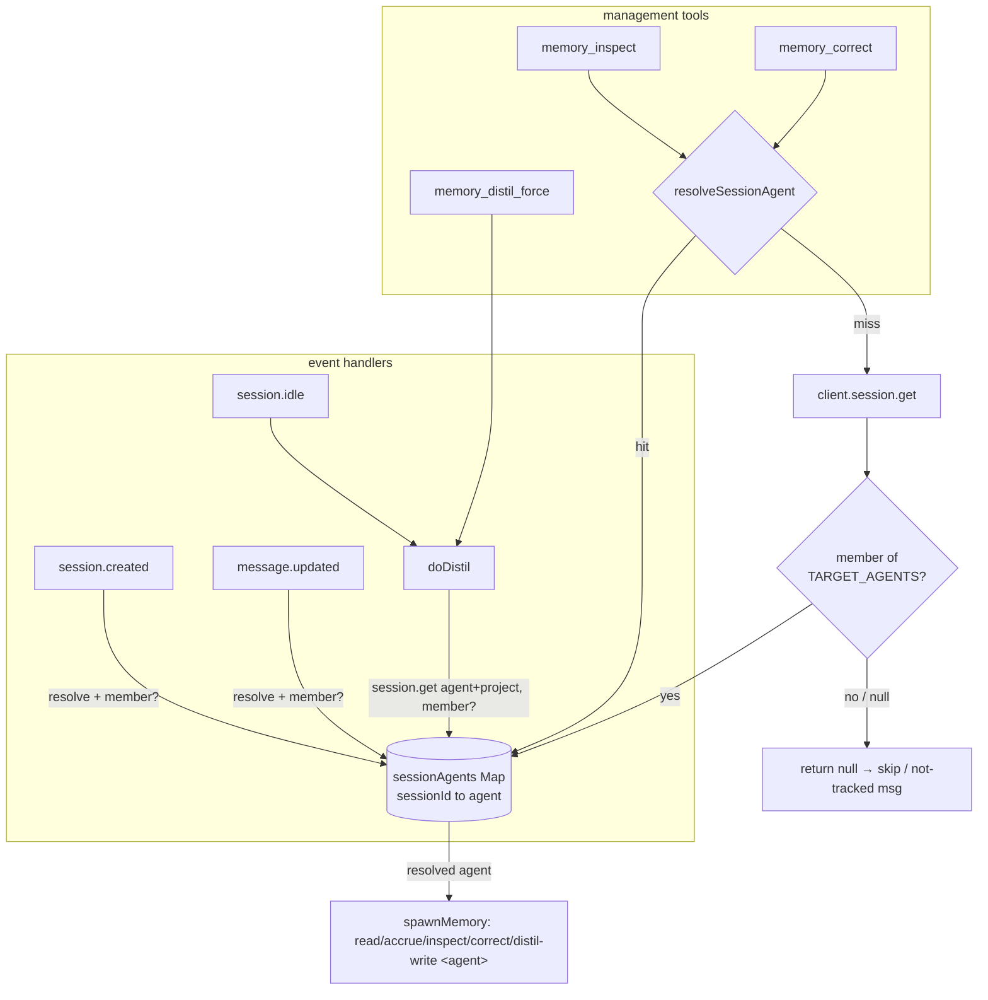

## Design — multi-agent tracking

Widen the plugin from one hard-wired `TARGET_AGENT` to a configured set of tracked
agents, resolving each session to its own agent and threading that per-session name
through every DB read/write and tool call. The DB schema is already keyed on
`(scope, agent, project)`, and `src/memory.js` already takes `agent` as a positional
argument on every subcommand — so **only `src/lib/config.js` and `src/plugin.js`
change** (plus `README.md`). `memory.js`, `schema.js`, `signal-utils.js`, and
`db.js` are untouched.

### Constraints (from alignment — treated as given)

1. `targetAgent: string` → `targetAgents: string[]` (array of non-empty strings).
2. `MEMORY_TARGET_AGENT` → `MEMORY_TARGET_AGENTS` (comma-separated).
3. No default — unconfigured ⇒ `[]` ⇒ no agents tracked.
4. Each session is tracked under **its own** agent name **from the list**; the three
   management tools operate on the calling session's resolved agent.

## Data structures

Replace the module-level `TARGET_AGENT: string` with a single membership set, and add
one per-session resolution map to the plugin's closure state.

- `TARGET_AGENTS: Set<string>` — module scope, built once from the resolved config
  array. Used for O(1) membership guards (`TARGET_AGENTS.has(agent)`). A `Set` is the
  right shape because every guard is a membership test, not an index lookup.
- `sessionAgents: Map<string,string>` — **closure scope** (alongside `primers`,
  `buffers`, `primerLoaded`), `sessionId → resolvedAgentName`. Holds only sessions
  whose agent is a tracked member. This is the bridge for tool calls, whose
  `ToolContext` carries `sessionID` and `directory` but **not** `agent`.

**`TARGET_AGENTS_ARRAY` is not introduced.** The proposal's Impact note anticipated an
ordered array for a `[0]` fallback; the null-agent decision below removes the only
consumer of it, so a second data structure would be speculative (YAGNI). The
proposal's Impact bullet should be trimmed to "`TARGET_AGENTS` Set + `sessionAgents`
Map" to match. If the null-agent decision is reversed (see its "reversal cost"), the
array is reintroduced then, not now.

### Decision — where the resolved name lives: module vs closure

- **Option A — module-scope map.** Symmetric with `TARGET_AGENTS`.
- **Option B — closure-scope map (chosen).** Placed with the other per-session state
  the factory already owns (`primers`, `buffers`). Trade-off: per-session mutable
  state belongs with the rest of the per-session state so its lifecycle is obvious and
  co-located; `TARGET_AGENTS` is immutable config and stays at module scope. Chosen for
  lifecycle cohesion.

## Session agent resolution flow

Introduce one shared resolver used by every code path that currently hard-codes
`TARGET_AGENT`, so the resolution rule exists in exactly one place:

```
resolveSessionAgent(sessionId) -> string | null
  1. hit  = sessionAgents.get(sessionId); if present -> return it
  2. miss -> client.session.get(sessionId) -> agent, (directory)
  3. if agent is a member of TARGET_AGENTS: sessionAgents.set(sessionId, agent); return agent
  4. otherwise (untracked or agentless) -> return null   // caller skips
```

- **Event handlers (`session.created`, `message.updated`)** already resolve `agent`
  from the event payload with a `session.get` fallback (the existing W2 path). Replace
  their `agent === TARGET_AGENT` checks with `TARGET_AGENTS.has(agent)`; on a hit,
  `sessionAgents.set(sessionId, agent)` and call
  `loadMemoryForSession(sessionId, agent, project)` with the **resolved** agent (the
  function already accepts an `agent` parameter — today it is always handed the
  constant).
- **`doDistil(sessionId)`** already calls `session.get` for `project`; reuse that call
  for `agent` too, populate `sessionAgents`, and use the resolved `agent` (not the
  constant) in every CLI arg (`read`, `accrue`, `distil-write`) and in the fallback
  `loadMemoryForSession`.
- **Tools (`memory_inspect`, `memory_correct`, `memory_distil_force`)** call
  `resolveSessionAgent(context.sessionID)`. `memory_distil_force` simply delegates to
  `doDistil`, which resolves internally. The two read/write tools use the returned
  agent in the CLI arg. **On `null`** (session's agent not tracked) the tool returns a
  clear message ("this session's agent is not tracked; no memory row") rather than
  reading or writing an arbitrary row — a deliberate behaviour change from the old
  always-succeeds single-agent contract.

### Decision — tool lookup fallback: map-only vs map+session.get

- **Option A — `sessionAgents.get` only**, informative message on miss. Simplest, but
  fragile to event ordering (a tool invoked before the session's first
  `message.updated` would spuriously report "not tracked").
- **Option B — map first, then one `session.get` resolve (chosen).** In practice a tool
  call is always preceded by user interaction, so `message.updated` has populated the
  map and the `session.get` almost never fires; keeping it makes the tool correct
  regardless of ordering, at the cost of one authoritative lookup on a cold miss.
  Centralising this in `resolveSessionAgent` means the cost and the rule live in one
  place.



## Null-agent session handling — **skip silently**

The current filter `if (agent && agent !== TARGET_AGENT) return;` lets a
null/undefined agent through and treats it as the single default agent. With a
configured set and **no default**, a session whose agent is still null after the
`session.get` resolution is **not tracked** — the guard becomes
`if (!agent || !TARGET_AGENTS.has(agent)) return;` everywhere.

### Options

- **Skip null (chosen).** Only sessions whose resolved agent is an explicit member are
  tracked.
- **Resolve null → first configured agent.** Preserve the old "default session is the
  tracked agent" behaviour, generalised to "the first listed agent is the primary."

### Rationale

- **Matches the stated constraints.** #4 requires a session be tracked under "its own
  agent name *from the list*" — a null agent has no name from the list. #3 removes the
  default — mapping null to element `[0]` reinstates a de-facto default.
- **Avoids misattribution.** With `→[0]`, any config whose first element is not the
  actual primary (e.g. tracking only `["architect"]` while an `engineer` primary
  reports null) would record the primary's activity under the wrong agent's row.
  Skipping fails closed instead of writing the wrong row.
- **Load-bearing assumption:** the flagship case (tracking the `engineer` primary) is
  only safe under "skip" if opencode's `session.get` returns a concrete `agent` name
  (e.g. `"engineer"`) for a primary session rather than null. The existing W2
  `session.get` fallback — added precisely to obtain `agent` when the event payload
  omits it — is in-repo evidence that the authoritative session record carries the
  name. This should be confirmed against the running opencode before implementation
  (see Assumptions).
- **Reversal cost is low.** If confirmation shows primary sessions resolve to null,
  switch to `→[0]`: reintroduce an ordered `TARGET_AGENTS_ARRAY`, change the resolver's
  step 4 to return `TARGET_AGENTS_ARRAY[0]` on a null (not untracked) agent, and
  document "list the primary agent first." No other code path changes.

## Distil guard update

`doDistil` today: resolve `agent`/`project` via `session.get`, then
`if (agent && agent !== TARGET_AGENT) return;`, then use `TARGET_AGENT` in all CLI
args. New:

- Guard becomes `if (!agent || !TARGET_AGENTS.has(agent)) return;` (skip-null folded
  in — an agentless or untracked session is not distilled).
- `sessionAgents.set(sessionId, agent)` on the passing path (opportunistic populate).
- Every subsequent `spawnMemory` call and the fallback `loadMemoryForSession` use the
  resolved `agent` variable instead of the constant.

The per-session `distil_watermark` (PK `session_id`) needs no change: a session maps
to exactly one agent, so a session-keyed watermark is still correct under multi-agent.

## Config validation (`resolveConfig`)

Return `{ targetAgents: string[], distilMinIntervalMs, distillerModel }`, keeping the
existing per-key precedence **env > file > default**, default `[]`.

- **Env `MEMORY_TARGET_AGENTS`** (when defined): `split(',')` → `trim` each →
  `filter(Boolean)`. Yielding `[]` is legitimate (nothing tracked); no warning.
- **File `targetAgents`** (when env absent and key present):
  - Not an array → `console.warn` (mirror existing per-key warnings) → default `[]`.
  - An array → keep elements that are non-empty strings; `console.warn` naming the key
    if any element is dropped as non-string/empty. Result may be `[]`.
- **Empty array is a valid, silent outcome** — it is the documented "unconfigured ⇒ no
  agents tracked" state (#3), so it must not warn. Deduplication is unnecessary in
  config: the plugin wraps the array in a `Set`, which dedupes for free.

Keep the JSDoc note that JSONC string-value corruption does not affect these keys —
agent names contain none of `//`, `/*`, `*/`.

## Unchanged — confirmed no design change

- **`distillerModel` and `distilMinIntervalMs`** remain process-global scalars: the
  distiller model and idle throttle are agent-independent, applied once per process,
  not per tracked agent. No change.
- **`src/memory.js`, `schema.js`, `signal-utils.js`, `db.js`** — the CLI already takes
  `agent` per subcommand; the schema is already `(scope, agent, project)`-keyed; the
  primer/`primers` Map is keyed by `sessionId` (one agent per session, no collision).

## `sessionAgents` Map lifecycle & growth

- **Added:** on first successful resolution of a tracked session (event handler,
  `doDistil`, or a tool's `resolveSessionAgent`). Written once per session.
- **Removed:** never, for real sessions — matching the existing `primerLoaded`,
  `primers`, and `buffers` maps, none of which evict. Ephemeral distil sub-sessions are
  never inserted (they are filtered by `ephemerals`).
- **Growth:** one short `sessionId → agentName` string entry per session — strictly
  smaller than the co-resident `primers` (full primer text) and `buffers` entries, so
  it introduces **no new** unbounded-growth profile beyond the one the plugin already
  accepts for long-running instances. Do **not** add per-map eviction here (YAGNI); if
  bounded memory is ever wanted it should evict all per-session maps together on a
  `session.deleted` signal, as a separate change.

## Component breakdown

- **Config resolution (`src/lib/config.js`)** — application code (Node/ESM). Rename key
  + env var, change return to `targetAgents: string[]`, add array validation.
  *Done:* `resolveConfig` returns the parsed array under env/file/default precedence;
  invalid file values warn and fall back to `[]`; existing config tests updated to the
  array shape and green.
- **Plugin wiring (`src/plugin.js`)** — application code. Replace `TARGET_AGENT` with
  `TARGET_AGENTS: Set`; add `sessionAgents` Map + `resolveSessionAgent`; update the two
  event handlers, `doDistil`, and the three tools to use the resolved per-session
  agent; apply the skip-null guard.
  *Done:* no `TARGET_AGENT` reference remains; every `spawnMemory` agent arg comes from
  a resolved session agent; a session whose agent is not a member is neither primed nor
  distilled and its tools report "not tracked".
- **Docs (`README.md`)** — documentation. Update the config-key/env-var table:
  `targetAgents` array, `MEMORY_TARGET_AGENTS` comma-separated, no default, updated
  validation rule; note the skip-null behaviour and (if confirmed) the "primary agent"
  guidance.
  *Done:* table and examples reflect the array config with no stale `targetAgent`
  reference.
- **Proposal touch-up (`openspec/changes/multi-agent-tracking/proposal.md`)** —
  documentation. Drop `TARGET_AGENTS_ARRAY` from the Impact bullet to match this design.
  *Done:* Impact lists only `TARGET_AGENTS` Set + `sessionAgents` Map.

## Assumptions / to confirm before implementing

- **opencode `session.get` returns a concrete `agent` for primary sessions.** The
  skip-null decision's safety for the flagship `engineer` case rests on this. In-repo
  evidence (the W2 fallback) supports it, but it is an external-behaviour fact — confirm
  against the target opencode version. If false, adopt the documented `→[0]` reversal.
