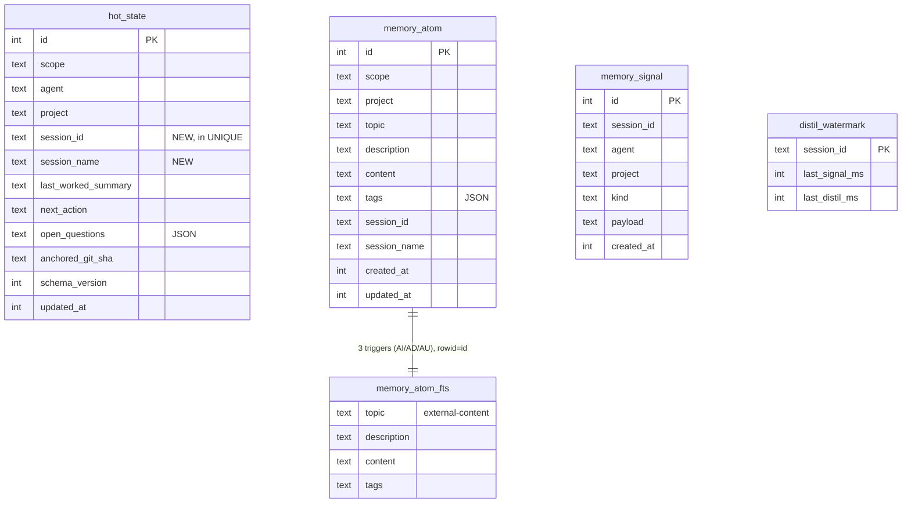
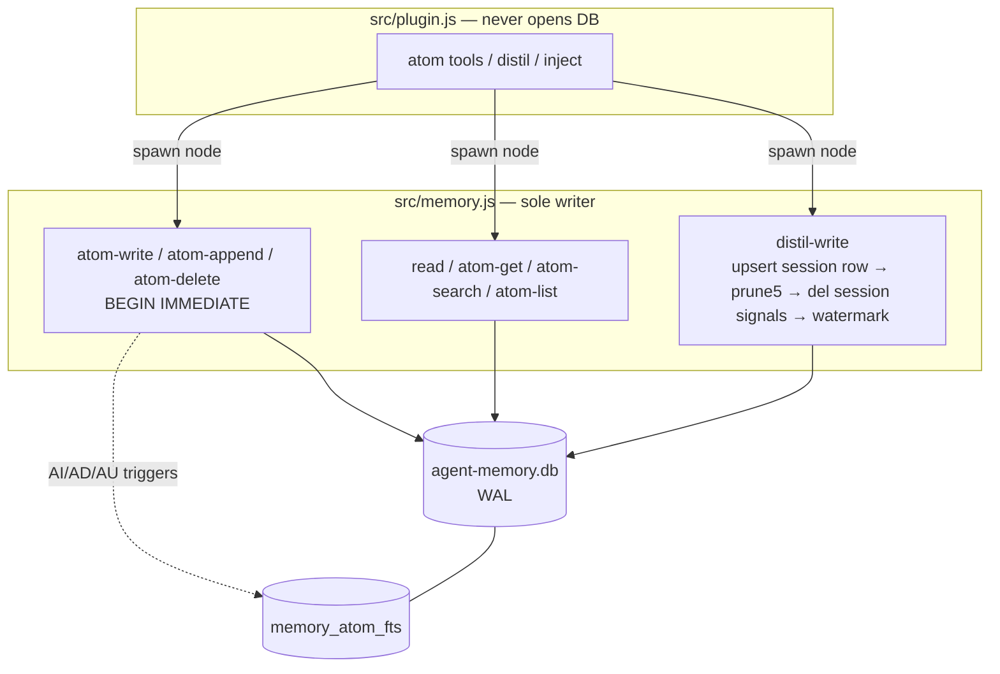

# Design — memory-atoms-and-session-hot-state

Implementation architecture for the change described in `proposal.md`. The
*what* and *why* are settled there and in
`.serena/memories/architecture/memory-redesign-vision.md`; this document designs
the *how*. It is the authoritative reference the engineer uses to write the
delta specs and implement the change.

## Constraints (given, not reopened)

- ESM, Node `>=22.5`, **zero new runtime dependencies** (semantic search deferred).
- **Sole-writer invariant**: only `src/memory.js` opens the DB; `src/plugin.js`
  never opens it directly. WAL is enabled; multiple `memory.js` processes may run.
- All CLI data arguments are passed as a **trailing JSON positional arg** (never
  stdin — see the `spawnMemory` stdin TypeError fix in the implementation memory).
- Fail-safe: every plugin path degrades to "no capture / no injection" and never
  throws into opencode.

## Decision summary

| Area | Decision |
|------|----------|
| hot_state constraint change | Canonical SQLite **table rebuild**, gated by `PRAGMA user_version` + `session_id`-column detection, in one transaction |
| Atom writes | New `memory.js` **`atom-*` subcommands** — reads *and* writes stay behind the sole-writer CLI |
| FTS5 | **External-content** (`content='memory_atom'`) + 3 triggers; `'rebuild'`/`'integrity-check'` for backfill/tests; LIKE fallback if FTS5 absent |
| Atom read path | Via CLI subprocess (not in-plugin DB opens) — because `ensureSchema` now runs a migration |
| assemblePrimer | New options-object signature: multi-row hot_state threads + project/global atom directories (capped, configurable) |
| distil-write | Session-scoped upsert + keep-last-5 prune + **session-scoped** signal read/delete, all in one transaction |
| Tool naming | Six `memory_atom_*` tools + three renamed `memory_state_*` tools (shared `memory_` prefix) |
| `adr_candidate` | Fully retired — dropped from the hot_state column (rebuild), distil output, `memory_state_patch` schema, and the primer |

---

## 1. Schema migration strategy

`ALTER TABLE … DROP CONSTRAINT` does not exist in SQLite, and
`CREATE TABLE IF NOT EXISTS` will **not** alter an existing table's UNIQUE
constraint. Adding `session_id`/`session_name` alone could use `ADD COLUMN`, but
the constraint change forces the documented **12-step table-rebuild recipe**.

**Chosen: rebuild `hot_state` in place** (keep the table name), gated so it runs
exactly once. Rejected alternative — a new table name (`hot_state_v2`) — because
it forces permanent dual-read logic or a later cleanup migration across the CLI's
four hot_state queries (YAGNI; more surface, no benefit).

**Idempotency gate.** Use SQLite's `PRAGMA user_version` (a DB-header integer) as
the migration counter, combined with a **shape probe** for correctness:

- Fast path: if `user_version >= 2`, skip migration entirely.
- Correctness probe: rebuild only when `PRAGMA table_info(hot_state)` shows **no
  `session_id` column** (so a fresh DB already created with the new schema is
  never rebuilt).

**`ensureSchema` restructured into two phases:**

```
1. Additive DDL (all IF NOT EXISTS, safe on every call):
   - memory_signal, distil_watermark  (unchanged)
   - hot_state  (NEW schema: adds session_id/session_name, UNIQUE(scope,agent,project,session_id))
   - memory_atom, memory_atom_fts, 3 triggers   (see §3)
   - indexes
2. Migration (gated on user_version < 2):
   a. if old-shape hot_state exists → rebuildHotState(db)
   b. migrateHotStateToAtoms(db)
   c. PRAGMA user_version = 2
   All of (a)+(b)+(c) inside ONE transaction.
```

**`rebuildHotState`** — the canonical recipe, in the migration transaction:

```sql
CREATE TABLE hot_state_new ( … new schema WITHOUT adr_candidate,
                             session_id TEXT NOT NULL DEFAULT '',
                             session_name TEXT, UNIQUE(scope,agent,project,session_id) );
INSERT INTO hot_state_new (scope,agent,project,last_worked_summary,next_action,
       open_questions,anchored_git_sha,schema_version,updated_at,
       session_id,session_name)
  SELECT scope,agent,project,last_worked_summary,next_action,open_questions,
         anchored_git_sha,schema_version,updated_at,'',NULL
  FROM hot_state;
DROP TABLE hot_state;
ALTER TABLE hot_state_new RENAME TO hot_state;
-- recreate idx_hot_state_lookup
```

Existing rows are singletons per `(scope,agent,project)`, so they migrate to the
`session_id=''` row with **no uniqueness collision**. The `adr_candidate` column
is **dropped** during the rebuild (not copied into the new schema) — this is the
DB-level half of the full `adr_candidate` retirement (see §4 tool schema, §5
primer, §6 distil output).

**`migrateHotStateToAtoms`** — for each migrated row with a non-empty
`last_worked_summary`, upsert an atom (`scope='project'`, that row's `project`)
at topic **`work/migrated-summary`**. Recommend this key over the vision doc's
`work/migrated-summary/{project}`: the atom's `project` column already scopes it,
and an absolute path inside the topic breaks `memory_atom_list('work/')` prefix
matching. Flag this refinement for the spec author.

**Migration-done marker.** `user_version = 2` is the authoritative gate. The
"sentinel atom" from the vision doc is redundant — drop it (YAGNI).

**Safety.** Because rebuild + atom copy + `user_version` bump share one
transaction, any failure rolls back to the intact old table with `user_version`
unchanged, so the next CLI invocation retries cleanly. This must have a test that
runs against a **populated old-schema DB** and asserts row preservation.

**Other tables need no migration.** `memory_signal` and `distil_watermark` are
untouched by the rebuild and require no migration step: both are created by the same
`CREATE TABLE IF NOT EXISTS` DDL, neither references `hot_state`, and
`distil_watermark` is keyed by `session_id` (PK) with only `last_signal_ms` /
`last_distil_ms` — a shape this change does not alter (confirmed against the current
`src/lib/schema.js`). They are purely additive/unchanged.

---

## 2. Sole-writer CLI pattern for the six atom tools

All six tools route through `memory.js` subcommands — **reads included**. The
task noted pure reads *could* open the DB in-plugin; that is rejected here because
`ensureSchema` now performs a **migration**: any in-plugin `openDb()` would either
re-run schema/migration logic in a second process (lock contention, double-migrate
risk) or need a bespoke no-schema read path that fails on a cold DB. Keeping the
invariant intact is the smaller, safer design. Subprocess latency (~node startup)
lands on agent-initiated tool calls, not the event hot path — acceptable. A
persistent reader is a future optimisation (YAGNI).

New subcommands (hyphen style matches `distil-write`):

| Tool | Subcommand | Args (JSON positional) | Txn |
|------|-----------|------------------------|-----|
| memory_atom_write | `atom-write <scope> <project> <json>` | `{topic,content,description,tags,sessionId,sessionName}` | BEGIN IMMEDIATE |
| memory_atom_append | `atom-append <scope> <project> <json>` | `{topic,content,sessionId,sessionName}` | BEGIN IMMEDIATE (read-modify-write) |
| memory_atom_delete | `atom-delete <scope> <project> <topic>` | — | BEGIN IMMEDIATE |
| memory_atom_get | `atom-get <scope> <project> <topic>` | — | plain SELECT |
| memory_atom_search | `atom-search <scope> <project> <json>` | `{query,limit}` | plain SELECT |
| memory_atom_list | `atom-list <scope> <project> <prefix?>` | — | plain SELECT |

> **Read-scope sentinels passed to the CLI (`atom-search`, `atom-list`).** After the
> tool-API→CLI scope translation (§4), the CLI receives `scope ∈
> {'project','global','all'}` plus a `project`, and branches on it:
> - **`atom-search` default (all workspaces):** plugin passes `scope='all'`,
>   `project=''`; the CLI branches on `scope === 'all'` to omit the scope/project
>   WHERE predicate (the cross-workspace JOIN form in §3).
> - **`atom-list` with `scope='all'`:** plugin passes `scope='all'`, `project=''`;
>   the CLI omits the scope/project predicate to include every workspace. `atom-list`
>   with no scope stays current-workspace + global (§8).
> - **`scope='project'`** passes the real `project`; **`scope='global'`** passes
>   `project=''`.

- **`atom-write`** — `INSERT … ON CONFLICT(scope,project,topic) DO UPDATE` (never
  `INSERT OR REPLACE` — see §7 risk 4). `description` is **required**; the
  subcommand errors (non-zero exit + stderr) if it is absent or empty. Sets
  `updated_at=now`; `created_at` is preserved on the update branch (DO UPDATE keeps
  the existing value). It reports whether the row was **created** or **overwritten**
  (e.g. via the pre-write existence check) so the tool can echo
  `"Created atom at <topic>"` vs
  `"Updated existing atom at <topic> (previous content overwritten)"` — letting an
  agent detect an accidental overwrite.
- **`atom-append`** — appends `content` to the existing atom's `content`, separated
  by `\n---\n`, atomically under `BEGIN IMMEDIATE` (read-modify-write). It does
  **not** create on missing: if the topic does not exist it errors with
  `"Atom '<topic>' does not exist — use memory_atom_write to create it first"`,
  preserving the invariant that every atom is created via `atom-write` with a
  required `description`. Returns the updated full content. No substring matching —
  append only.
- **Topic normalisation (`normaliseTopic`).** One shared helper lowercases,
  collapses spaces and underscores to hyphens, and strips leading/trailing slashes.
  It is applied at **two** points:
  - at ingest, to the stored key on `atom-write` and `atom-append`; and
  - to the **lookup input** on `atom-get` (the `topic`) and `atom-list` (the
    `prefix`), so a stored normalised key is always reachable however the agent
    spells it (`My Topic`, `my_topic`, `my-topic` all resolve to `my-topic`).

  `atom-search` does **not** normalise — its `query` is FTS text, not a topic key.
  Read-scope semantics (`atom-get` priority resolution, `atom-search`/`atom-list`
  cross-workspace defaults) are detailed in §8.
- **CLI-side `scope`/`project`:** the CLI always receives `scope ∈
  {'project','global','all'}` plus a `project` string. The plugin derives these from
  the tool-API `scope` via `resolveScope` (§4) before spawning.

---

## 3. FTS5 content table strategy

External-content FTS5 indexes four columns and stores no data of its own,
fetching column values from `memory_atom` by rowid. Because `id INTEGER PRIMARY
KEY AUTOINCREMENT` **is** the rowid alias, `content_rowid='id'` is satisfied.

```sql
CREATE VIRTUAL TABLE memory_atom_fts USING fts5(
  topic, description, content, tags,
  content='memory_atom', content_rowid='id'
);
```

**Three triggers** (exact external-content pattern; `'delete'` control-insert
removes stale index entries using the *old* column values):

```sql
CREATE TRIGGER memory_atom_ai AFTER INSERT ON memory_atom BEGIN
  INSERT INTO memory_atom_fts(rowid,topic,description,content,tags)
  VALUES (new.id,new.topic,new.description,new.content,new.tags);
END;
CREATE TRIGGER memory_atom_ad AFTER DELETE ON memory_atom BEGIN
  INSERT INTO memory_atom_fts(memory_atom_fts,rowid,topic,description,content,tags)
  VALUES ('delete',old.id,old.topic,old.description,old.content,old.tags);
END;
CREATE TRIGGER memory_atom_au AFTER UPDATE ON memory_atom BEGIN
  INSERT INTO memory_atom_fts(memory_atom_fts,rowid,topic,description,content,tags)
  VALUES ('delete',old.id,old.topic,old.description,old.content,old.tags);
  INSERT INTO memory_atom_fts(rowid,topic,description,content,tags)
  VALUES (new.id,new.topic,new.description,new.content,new.tags);
END;
```

**Upsert correctness.** `ON CONFLICT DO UPDATE` fires the **UPDATE** trigger and
keeps `id`/rowid stable, so FTS stays in sync through both insert and update
branches. This is precisely why `INSERT OR REPLACE` is banned (it deletes +
reinserts under a *new* rowid, orphaning FTS rows).

**Backfill / rebuild.** `memory_atom` is new, so the §1 atom migration inserts
rows through the triggers — no manual backfill needed. Provide the control
commands for recovery and testing:

- `INSERT INTO memory_atom_fts(memory_atom_fts) VALUES('rebuild');` — drop & rebuild
  the whole index from the content table (offer as an optional `atom-reindex`
  maintenance subcommand only if a need appears — YAGNI otherwise).
- `INSERT INTO memory_atom_fts(memory_atom_fts) VALUES('integrity-check');` — throws
  on desync; assert it in tests after write/append/delete/upsert.

**Search query (external-content needs a JOIN).** `scope`/`project` live on
`memory_atom`, **not** on the FTS virtual table, so a filtered search must join back
to the base table on `rowid = id`. Scoped form:

```sql
SELECT m.topic, m.description, m.content, m.scope, m.project, m.updated_at,
       snippet(memory_atom_fts, 2, '<b>', '</b>', '…', 10)
FROM memory_atom_fts
JOIN memory_atom m ON m.id = memory_atom_fts.rowid
WHERE memory_atom_fts MATCH ?
  AND m.scope = ? AND m.project = ?
ORDER BY bm25(memory_atom_fts) LIMIT ?;
```

Cross-workspace default (no scope filter — the `atom-search` default, see §8) omits
the scope/project predicates:

```sql
SELECT m.topic, m.description, m.content, m.scope, m.project, m.updated_at,
       snippet(memory_atom_fts, 2, '<b>', '</b>', '…', 10)
FROM memory_atom_fts
JOIN memory_atom m ON m.id = memory_atom_fts.rowid
WHERE memory_atom_fts MATCH ?
ORDER BY bm25(memory_atom_fts) LIMIT ?;
```

**FTS5-absent degradation (see §7 risk 1).** Wrap the FTS virtual-table + trigger
DDL in try/catch so `ensureSchema` cannot hard-fail on an FTS5-less `node:sqlite`;
have `atom-search` fall back to a `LIKE`-scan over topic/description/content when
`MATCH` errors with "no such module: fts5". If the engineer confirms FTS5 is
present in the target Node, the fallback may be dropped (YAGNI) — but the
capability is unverified in this design (permission-blocked probe), so the
defensive path is recommended until confirmed.

---

## 4. Atom tool implementation in `plugin.js` and the read path

With §2, the "read vs write" split is **transactional shape**, not "spawn vs
direct": all six spawn `memory.js`; writes use `BEGIN IMMEDIATE`, reads are plain
SELECTs. Plugin-side helpers:

- Reuse `spawnMemory($, args, jsonData)` for writes; add a thin
  `spawnMemoryJson($, args)` that spawns + `JSON.parse`es stdout for reads.
- **Scope translation (tool API → CLI/DB).** The agent-facing tools use
  `scope='workspace'` to mean "current project"; the CLI and DB use
  `scope='project'`. A single `resolveScope(scope, directory)` helper in `plugin.js`
  performs the mapping before every spawn: `'workspace'`|undefined →
  `{scope:'project', project:directory}`; `'global'` → `{scope:'global',
  project:''}`; `'all'` → `{scope:'all', project:''}` (reads only). Writes accept
  only `'workspace'` or `'global'`. This is the single place the `workspace`↔`project`
  rename lives.
- `memory_atom_write` / `memory_atom_append` provenance: capture `session_name` in
  a new `sessionNames` `Map<sessionId,title>` populated at `session.created` from
  `event.properties.info.title`; pass `context.sessionID` + looked-up name (or
  null) into `atom-write`/`atom-append`. Session params are captured server-side,
  **not** agent arguments — the tool signatures in the proposal stay as written.
- Tool output is human-readable text (matching `memory_state_inspect`):
  `memory_atom_search` returns a `topic — description — snippet` list;
  `memory_atom_get` returns full content; `memory_atom_list` returns a topic
  directory; `memory_atom_write` returns the create-vs-overwrite confirmation (§2);
  `memory_atom_append` returns the updated full content; `memory_atom_delete`
  returns a one-line confirmation — each surfacing the CLI error message on failure.

The three existing hot_state tools are **renamed** (behaviour otherwise
unchanged): `memory_inspect → memory_state_inspect`,
`memory_correct → memory_state_patch`, `memory_distil_force → memory_state_distil`.

- **`memory_state_patch`** is affected by the constraint change: it passes
  `context.sessionID`, and `cmdCorrect`'s `ON CONFLICT` target becomes
  `(scope,agent,project,session_id)`. Its arg schema **drops `adr_candidate`
  entirely** — no longer patchable (part of the full retirement, not
  accept-and-ignore). It **upserts a skeleton row** when none exists for
  `(scope,agent,project,session_id)`: insert `last_worked_summary=NULL`,
  `next_action=NULL`, `open_questions='[]'`, then apply the patch — so an agent can
  set state before the first distil. The tool returns whether a row was **created**
  or **updated**. (The existing `cmdCorrect` already upserts via
  `INSERT … ON CONFLICT DO UPDATE`; this refines the skeleton defaults to NULL and
  adds the created/updated confirmation.) The CLI signature gains the session
  positional: `correct <agent> <project> <sessionId> <patchJson>` (was
  `correct <agent> <project> <patchJson>`).
- **`memory_state_inspect`** takes this exact tool description, to distinguish it
  from the atom tools: *"Read the current agent memory hot state for this session:
  recent session threads, current signals, and the loaded primer. Does not list
  durable atoms — use `memory_atom_list` for the atom directory or `memory_atom_get`
  to fetch a specific atom by topic."*

---

## 5. `assemblePrimer` redesign

Current: `assemblePrimer(prior, agent, project, staleness)` → single block.
New signature (options object — inputs have grown, and stay extensible):

```
assemblePrimer({ rows, projectAtoms, globalAtoms, agent, project, staleness, cap })
```

- `rows`: up to 3 hot_state rows, newest first (the read query does
  `ORDER BY updated_at DESC LIMIT 3` for `(scope,agent,project)`).
- `projectAtoms` / `globalAtoms`: directory rows
  `{topic, description, content, updated_at}` for the two scopes, rendered in
  **separate labelled sub-sections**. Each is capped independently at `cap`.
- `cap`: atom-directory cap, default **40**, resolved from the new `atomInjectCap`
  config-file key (integer, default 40). A sub-section exceeding `cap` emits the
  overflow line `(+N more — call memory_atom_list to see all)`.
- `staleness`: computed **once** for the newest row's `anchored_git_sha` (avoid a
  git rev-list per row at inject); older threads show relative time only.
- `adr_candidate` has **no slot** in the primer — removed as part of the full
  retirement (§1 column, §4 tool schema, §6 distil output).

**Section format** (single injected string):

```
## Project memory — <last-two-path-segments> (background context — no action required)

Snapshot from your recent sessions. Wait for the user's request before acting.

### Recent sessions
▸ <session_name || short session_id> — <relative time>
  Last: <last_worked_summary>
  Next: <next_action>
  Open questions: <q; q>            (or "none")
▸ <session_name> — <relative time>
  …
Staleness: <renderStaleness(staleness)>

### Project atoms — search: memory_atom_search · fetch: memory_atom_get
(Fetch atoms on demand when relevant — do not pre-fetch at session start)
<topic> [<relative time>] — "<description>" — <first-80-chars-of-content>…
(+N more — call memory_atom_list to see all)

### Global atoms
(Fetch atoms on demand when relevant — do not pre-fetch at session start)
<topic> [<relative time>] — "<description>" — <first-80-chars-of-content>…
```

- `formatRelativeTime(updatedAt, now)` → `just now | Nm ago | Nh ago | yesterday |
  N days ago` (in `signal-utils.js`) — used both for the recent-session times and
  for each atom's `[<relative time>]` recency tag.
- Content preview: first 80 chars, newlines→spaces, ellipsis when truncated.
- Each atom sub-section is capped and may be empty; an empty sub-section collapses to
  a one-liner ("No project atoms yet" / "No global atoms yet"). When **all** atoms
  are absent in a warm primer, both collapse to a single
  "No atoms yet — capture durable notes with memory_atom_write" line.
- **Cold start (no hot_state rows).** The `### Recent sessions` section is omitted.
  If any **global** atoms exist, inject a minimal primer containing only the
  `### Global atoms` section (project atoms are not injected on cold start). If there
  are no hot_state rows **and** no global atoms, inject nothing at all — no primer,
  no injection. Project atoms are omitted on cold start because no prior session
  thread has established which atoms are relevant to the current task; global atoms
  are the exception, carrying cross-project context that is always applicable.

> **Finding — stale spec.** `openspec/specs/signal-processing.md` still requires a
> `[MEMORY — resumed context for <agent> in …]` header, an ADR slot, and a
> "teach-back block", but the shipped `assemblePrimer` emits `## Project memory —
> …` with none of these. The spec is already out of sync with the code. Per the
> proposal, the `signal-processing` delta must first rebaseline the spec to the
> shipped format, then apply this multi-row + dual-atom-directory format (no ADR
> slot, no teach-back).

---

## 6. `distil-write` changes

The distil transaction grows from three steps to four and narrows its scope to
the session.

**Distil output & prompt (`distil-prompt.js`):** drop `adr_candidate` — 3 fields
(`last_worked_summary`, `next_action`, `open_questions`). Update `DISTIL_SCHEMA`,
`parseDistilReply`, `EMPTY_RECORD`, **and** the distiller prompt (`src/prompts/
distiller.md` plus the inline fallback in `plugin.js#getDistillerPrompt`, which
still names four keys).

**Upsert → session row.** `INSERT … VALUES(…, session_id, session_name, …)` with
`ON CONFLICT(scope,agent,project,session_id) DO UPDATE … WHERE
excluded.updated_at > hot_state.updated_at`. The `adr_candidate` column no longer
exists (dropped in the §1 rebuild), so no distil site references it.

**Monotonic guard semantics (per the task's question).** The guard now protects a
**single session's** row from regressing when two idle distils of *the same
session* race. **Across** sessions there is no contention — different `session_id`
values are disjoint rows — which is exactly the cross-session-overwrite bug this
change removes. `now = Date.now()` remains the monotonic value.

**Keep-last-5 prune** (same transaction, after upsert):

```sql
DELETE FROM hot_state
WHERE scope='project' AND agent=? AND project=? AND id NOT IN (
  SELECT id FROM hot_state
  WHERE scope='project' AND agent=? AND project=?
  ORDER BY updated_at DESC, id DESC LIMIT 5);
```

Extract as a `pruneHotState(db, agent, project)` helper in `schema.js`. Test that a
6th session evicts the oldest.

**Session-scope the signals (consequence the task framing exposes).** Signals carry
`session_id`, but today `read` folds and `distil-write` DELETEs signals by
`(agent,project)` **across all sessions**. Under the per-session model, session A's
distil would consume/delete session B's unfolded signals. Fix:

- `read <sessionId> …` signal SELECT gains `AND session_id = ?`.
- `distil-write` signal DELETE gains `AND session_id = ?`.
- `inspect` stays project-wide (human visibility only).

Known limitation to document: `file.edited` carries no session id and is attributed
to `lastActiveSessionId` (a single-worktree heuristic), so under truly parallel
sessions an edit may land in the wrong session's signals. Pre-existing; acceptable
for this scope.

**Composite read for inject.** `read` returns
`{ prior, recent, signals, watermark }`: `prior` = this session's row (distil
baseline), `recent` = top-3 rows (inject), `signals` = **this session's** signals.
Inject issues a second `atom-list` spawn for the directory rather than folding the
atom scan into `read` (which the distil loop calls repeatedly) — one extra spawn
once per session vs. an atom query on every distil cycle.

---

## 7. Risk register

1. **FTS5 not compiled into the target `node:sqlite`** *(high; unverified)* — the
   `CREATE VIRTUAL TABLE … fts5` DDL throws and search dies. This design could not
   probe the target runtime (running `node` was permission-blocked; the linuxbrew
   binary links SQLite dynamically so a `strings` probe was inconclusive).
   *Mitigation:* engineer runs a one-line FTS5 probe against the deployment Node
   first; wrap FTS DDL + triggers in try/catch; degrade `atom-search` to a LIKE
   scan so write/get/list survive without FTS5; document the minimum Node version
   that bundles it.
2. **Migration data loss / partial rebuild** *(high)* — a mid-rebuild failure could
   drop `hot_state`. *Mitigation:* rebuild + atom copy + `user_version` bump in one
   transaction (ROLLBACK restores the old table, gate un-bumped → clean retry);
   shape-probe so fresh DBs are never rebuilt; mandatory test against a populated
   old-schema DB.
3. **Cross-session signal consumption** *(medium; newly exposed)* — per-session
   hot_state without session-scoped signals lets one session delete another's
   signals. *Mitigation:* scope `read`/`distil-write` signal SELECT/DELETE by
   `session_id` (§6); document the `file.edited` attribution heuristic.
4. **FTS desync via `INSERT OR REPLACE`** *(medium)* — replace-style upserts change
   the rowid, orphaning external-content FTS entries. *Mitigation:* use
   `ON CONFLICT DO UPDATE` exclusively (stable id): `atom-write` keeps a stable rowid
   on both its first-insert and its overwrite branch, and `atom-append` only ever
   issues an `UPDATE` (it errors when the topic is absent, so it has no
   rowid-changing INSERT path); assert `'integrity-check'` in tests after every atom
   mutation.
5. **Unbounded hot_state growth** *(low-medium)* — a wrong prune predicate lets rows
   accumulate per project. *Mitigation:* run keep-last-5 in the distil transaction;
   regression test the 6-session eviction.
6. **Unbounded atom content growth via `memory_atom_append`** *(low)* — repeated
   appends grow a single atom's `content` without limit, bloating the FTS index and
   `atom-get` payloads. *Mitigation:* the primer preview is capped at 80 chars so
   inject stays bounded regardless; a soft per-atom character cap surfaced as a tool
   hint (per the vision doc) is a future nicety, not required now (YAGNI). The
   required `description` on `atom-write` is an orthogonal guard that keeps
   created atoms self-describing and searchable.

---

## 8. Cross-workspace access model

**Core principle.** A workspace-scoped atom is *readable from any session*. `scope`
and `project` determine **injection priority and context labelling**, not read
access — removing the Serena silo problem. Writes stay scoped
(`atom-write`/`atom-append`/`atom-delete` target one `(scope,project,topic)`); only
the three read paths widen.

**`atom-get` — priority resolution + foreign listing.** Resolves the single best
full-content match, then lists same-topic atoms in *other* workspaces as previews
only (never their full content):

```sql
-- (1) Best full-content match: current workspace preferred, else global.
SELECT topic, description, content, scope, project, updated_at
FROM memory_atom
WHERE topic = ?
  AND ( (scope='project' AND project=?) OR (scope='global' AND project='') )
ORDER BY CASE WHEN scope='project' AND project=? THEN 0 ELSE 1 END
LIMIT 1;

-- (2) "Also in other workspaces": same topic, excluding current workspace + global.
SELECT topic, description, substr(content,1,80) AS preview, project, updated_at
FROM memory_atom
WHERE topic = ?
  AND NOT (scope='global' AND project='')
  AND NOT (scope='project' AND project=?)
ORDER BY updated_at DESC;
```

Response shape: `{ match: <full row | null>, alsoIn: <preview rows> }`. When (1)
returns nothing, `match` is null and only the `alsoIn` listing comes back — no
foreign content is loaded. The agent then widens access explicitly via
`atom-search` or a project-filtered read. The `topic` is normalised (§2) before
both queries.

**`atom-search` — all atoms by default.** No scope restriction by default (the
cross-workspace JOIN form in §3, with no scope/project predicate). Each result shows
its `scope` + `project` as context. The optional `scope` narrows to `'workspace'`
(adds `m.scope='project' AND m.project=?`) or `'global'` (adds `m.scope='global' AND
m.project=''`).

**`atom-list` — current workspace + global by default.** Prefix match scoped to the
current workspace and global:

```sql
SELECT topic, description, substr(content,1,80) AS preview, scope, project, updated_at
FROM memory_atom
WHERE topic LIKE ? || '%'
  AND ( (scope='project' AND project=?) OR (scope='global' AND project='') )
ORDER BY topic;
```

`scope='all'` drops the scope/project predicate to include every workspace; results
show project context. The `prefix` is normalised (§2) before the `LIKE`.

**Injection scope is unchanged.** `session.created` injects only current-workspace
atoms + global atoms (see §5, including the cold-start global-only path);
other-workspace atoms are never injected — they are discoverable through
`atom-search` and `atom-get`'s foreign listing on demand.

---

## Data model (Mermaid)



## Write & inject flow (Mermaid)



---

## Component breakdown

All parts are **Node.js application code** (load the `coding`/`tdd` skills); no IaC,
UI, or infra. Done-criteria below.

- **`src/lib/schema.js`** — new `hot_state` DDL (no `adr_candidate`); `memory_atom`
  + `memory_atom_fts` + 3 triggers (FTS DDL in try/catch); `user_version`-gated
  migration (`rebuildHotState`, `migrateHotStateToAtoms`); `pruneHotState` helper;
  atom CRUD helpers (`atomWrite` with required `description` + create/overwrite
  report, `atomAppend`, `atomGet`, `atomSearch` with LIKE fallback, `atomList`,
  `atomDelete`) and a shared `normaliseTopic`. *Done:* fresh-DB and populated-old-DB
  migrations both idempotent; `integrity-check` passes; existing rows preserved.
- **`src/memory.js`** — `distil-write` (session upsert + prune5 + session-scoped
  signal delete); `correct <agent> <project> <sessionId> <patchJson>` (session-keyed
  upsert, `adr_candidate` removed, skeleton-on-missing); `read`
  (`prior` + `recent` + session-scoped `signals`); six `atom-*` subcommands
  (`atom-write`/`atom-append`/`atom-get`/`atom-search`/`atom-list`/`atom-delete`)
  delegating to the schema.js helpers. *Done:* each subcommand covered by white-box
  SQL + CLI-subprocess tests.
- **`src/lib/distil-prompt.js`** — 3-field `DISTIL_SCHEMA` / `parseDistilReply` /
  `EMPTY_RECORD` (no `adr_candidate`). *Done:* parser rejects/ignores a 4th key;
  schema round-trips.
- **`src/lib/signal-utils.js`** — options-object `assemblePrimer` (multi-row +
  project/global atom directories, per-scope cap, overflow line, no-action framing,
  no ADR slot); `formatRelativeTime`. *Done:* multi-row ordering, per-scope
  empty/overflow branches, and cold-start covered.
- **`src/lib/config.js`** — resolve the new `atomInjectCap` key (integer, default
  40; env > file > default, per-key type validation like the existing three keys).
  *Done:* invalid values warn and fall back to 40.
- **`src/plugin.js`** — `sessionNames` Map from `session.created`; six
  `memory_atom_*` tool registrations + three renamed `memory_state_*` registrations
  (replacing `memory_inspect`/`memory_correct`/`memory_distil_force`);
  `loadMemoryForSession` builds the multi-row + dual-atom primer (read + project &
  global `atom-list`); `doDistil` passes `sessionId`+`sessionName`;
  `memory_state_patch` passes `context.sessionID` as the `<sessionId>` positional to
  `correct` and drops `adr_candidate`; inline
  distiller fallback → 3 keys; `atomInjectCap` threaded into the primer. *Done:*
  tool factory shape + per-tool delegation tests; fail-safe (no throw) preserved.
- **`src/prompts/distiller.md`** — drop `adr_candidate` from the instruction.
  *Done:* prompt names exactly three output keys.
- **Spec deltas (engineer authors in `openspec/specs/`)** — `memory-store` (new
  constraint, columns, `adr_candidate` column dropped, atom tables/triggers/CRUD,
  topic normalisation, migration, prune5, session-scoped signals, `memory_state_patch`
  skeleton upsert); new `memory-atom` and `memory-atom-tools` capabilities (six
  `memory_atom_*` tools, cross-workspace read model §8); `memory-state-tools`
  (rename of the three tools, `memory_state_patch` schema drop + skeleton upsert,
  `memory_state_inspect` description); `plugin-lifecycle` (session_name capture, new
  inject format, cold-start global-only path, `atomInjectCap`); `signal-processing`
  (rebaseline to the shipped format, then apply the multi-row + dual-atom-directory
  format with no ADR slot).

## Resolved decisions

The open questions from the prior design pass are now settled:

- **`memory_atom_append` semantics** — append-only: `content` is appended to the
  existing atom separated by `\n---\n`; a **missing topic errors** (no create-on-
  missing) so the required-`description` invariant holds; the updated full content
  is returned. No substring matching (this fully replaces the earlier
  `memory_replace`/`atom-replace` idea).
- **Cross-workspace access** — workspace atoms are readable from any session;
  `scope`/`project` set injection priority and labelling, not access (§8).
- **Atom inject cap** — default **40**, tunable via the `atomInjectCap` config key;
  each of the project and global sub-sections is capped independently and emits
  `(+N more — call memory_atom_list to see all)` on overflow.
- **Global-atom injection** — confirmed: the primer lists project atoms and global
  atoms in two separately labelled, independently capped sub-sections (§5).
