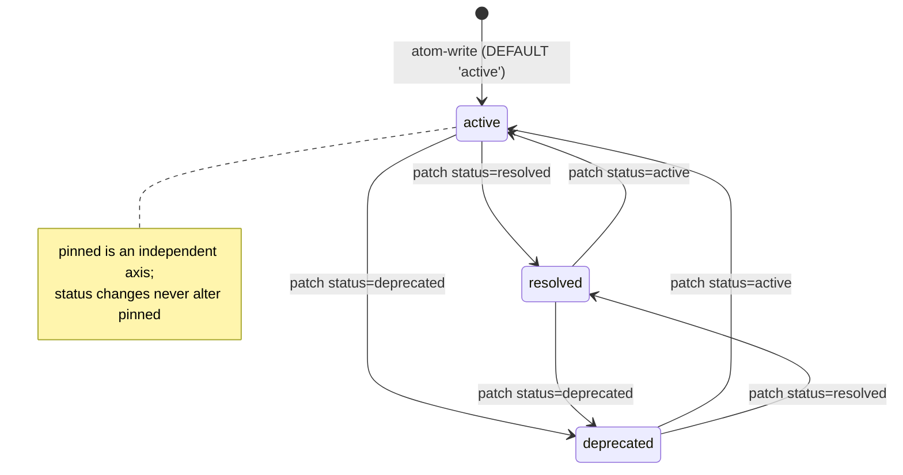
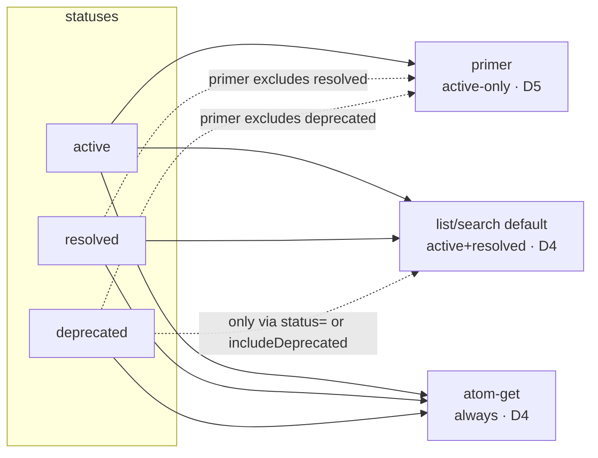

# Design — atom-status

Design companion for the `atom-status` change. Read `proposal.md` first for the *why* and the
three-tier visibility model. This document records the *how*: the decisions, their rationale, the
rejected alternatives, and the migration plan. Requirements implied here are transcribed into
`specs/` by the engineer — this file writes no specs.

## Context

`memory_atom` is a single SQLite table (schema **v3**, just shipped) fronted by one writer CLI
(`src/memory.js`) and a set of plugin tools (`src/plugin.js`) that spawn the CLI. Atoms accumulate
and go stale, but deletion loses history. The change adds a `status` lifecycle
(`active | resolved | deprecated`) so agents can retire an atom from routine surfaces while keeping
it retrievable.

Grounding facts observed in the current code (not assumed):

- **v2/v3 migration pattern** in `ensureSchema` (`schema.js`): version gate → `PRAGMA table_info`
  shape probe → `db.exec('BEGIN')` / try / `ALTER TABLE … ADD COLUMN` / `PRAGMA user_version = N`
  / `COMMIT`, with explicit `ROLLBACK` on error; the idempotent branch just bumps `user_version`.
  The baseline `CREATE TABLE IF NOT EXISTS` (Phase 1) already carries every migrated column so a
  fresh DB is schema-identical to a migrated one. The existing `memory-atom` spec makes that
  convergence a hard requirement ("Fresh and migrated databases are schema-identical").
- **`atomWrite`** already treats `pinned` as INSERT-only (absent from `ON CONFLICT DO UPDATE SET`)
  but still threads a `pinnedValue` into the INSERT column list.
- **`atomPatch`** builds a dynamic `UPDATE` from a `PATCHABLE` allowlist and bumps `updated_at`
  when `description | tags | pinned` is present (not for `created_at`-only).
- **`atomList`** SELECTs `scope, project, topic, description, substr(content,1,80) AS preview,
  pinned, created_at, updated_at` and orders `pinned DESC, …`. **`atomSearch`** projects the same
  minus `pinned`. **`atomGet`** projects the `match` row and the `alsoIn` foreign listing.
- **`renderAtomLine`** is a **non-exported** helper in `signal-utils.js` used **only** by
  `assemblePrimer`; it already branches on `{ pinned }`. The plugin's `memory_atom_list` /
  `memory_atom_search` / `memory_atom_get` output formatters are **separate** inline renderers in
  `plugin.js` and do not call `renderAtomLine`.
- **CLI arg conventions:** `atom-search` and `atom-patch` take a JSON blob as their 3rd positional;
  `atom-list` takes an optional positional `prefix`; `atom-get` takes a positional `topic`. There is
  **no flag parser** in the codebase.
- **FTS5** is an external-content virtual table over `memory_atom` with three sync triggers; `status`
  is metadata, not searchable text.

## Goals

- Add a `status` column (schema **v4**) with `active` default, enforced consistently on both
  provisioning paths (fresh `CREATE` and migrated `ALTER`).
- Give agents a non-destructive lifecycle: `resolved` (done, keep in routine list/search),
  `deprecated` (hidden from routine list/search, still retrievable point-lookup).
- Preserve every existing invariant: DEFAULT-driven writes never silently reset status; pin and
  status stay independent; the two provisioning paths stay schema-identical.
- Keep the CLI contract additive — no flag parser, minimal disruption to existing positional calls.

## Non-Goals

- No new capability/tool; this extends `memory-atom`, `memory-atom-tools`, `signal-processing`.
- No automatic status transitions (nothing auto-resolves or auto-deprecates; no coupling to pin).
- No status in the FTS index or its triggers.
- No status filter on `atom-get` (point-lookup always returns).
- No change to `atom-write`'s create/overwrite reporting, `atom-append`, or `atom-delete`.

## Decisions

### D1 — Column definition, with CHECK on **both** provisioning paths

`status TEXT NOT NULL DEFAULT 'active' CHECK(status IN ('active','resolved','deprecated'))`,
present **identically** in the baseline `CREATE TABLE` and in the v4 `ALTER TABLE … ADD COLUMN`.

**Rationale.** SQLite permits a `CHECK` constraint on `ALTER TABLE ADD COLUMN` (verified against the
SQLite `lang_altertable` reference: ADD COLUMN prohibits only `PRIMARY KEY`/`UNIQUE` and non-constant
defaults; `CHECK` is allowed and is validated against existing rows). Because the new column defaults
to `'active'`, every existing row satisfies the constraint, so validation cannot fail. Keeping the
identical CHECK on both paths is the *only* option that satisfies the settled invariant "fresh and
migrated databases are schema-identical" while giving a DB-level guard. The proposal's stated intent
("validates … at both the DB level (CHECK) and the tool/CLI layer") is met in full.

**Rejected alternative — the task's contingency "omit CHECK from the ALTER, keep it in CREATE".**
This is both unnecessary (CHECK-on-ADD-COLUMN works here) and *harmful*: it produces a fresh DB with
the CHECK and a migrated DB without it — a schema divergence that violates the convergence invariant
and its existing spec scenario. Rejected.

**Rejected alternative — app-layer-only enforcement (no CHECK anywhere).** Convergent and simple, but
discards a free, correct DB-level guard the proposal explicitly wants. Kept only as the fallback
*if* a future SQLite build in `node:sqlite` ever rejected the constraint — in which case CHECK must
be dropped from **both** paths together, never from one. (See Risks.)

### D2 — `atomWrite`: DEFAULT-driven, status absent from INSERT and upsert

`status` is omitted from both the INSERT column list and the `ON CONFLICT DO UPDATE SET`. The column
`DEFAULT 'active'` sets new rows; re-writing content never touches status. No `statusValue` variable.

**Rationale.** Cleaner than the `pinned` precedent: `pinned` had to thread `pinnedValue` because its
"created-as-true" is caller-driven; status has a single fixed birth value (`active`), so the column
default expresses it with zero code. This structurally guarantees the proposal's "status is preserved
on content re-write — never silently reset".

**Rejected alternative — mirror `pinned` exactly** (thread a `statusValue`, add to INSERT list,
exclude from `ON CONFLICT`). Works, but adds a variable and a bind parameter for a value that is
always `'active'` on insert — the DB default already does it. Rejected on YAGNI/clarity.

### D3 — `atomPatch`: status is patchable, enum-validated at the app layer, bumps `updated_at`

Add `status` to the `PATCHABLE` allowlist with an `if ('status' in patch)` guard mirroring `pinned`.
Validate the value against the enum in `atomPatch` (schema.js) *and* reject at the CLI JSON parse
(and Zod at the tool layer, D9). Including `status` bumps `updated_at` (same condition class as
`description | tags | pinned`).

**Rationale.** The DB CHECK is a backstop; a clear app-layer rejection gives a good error message and
keeps the tool/CLI contract self-describing. `updated_at` bump: a lifecycle change is a meaningful
metadata mutation, consistent with the existing bump rule for `pinned`.

**Rejected alternative — rely solely on the DB CHECK for validation.** A CHECK violation surfaces as a
generic SQLite error, not an actionable "must be one of active/resolved/deprecated". Rejected.

### D4 — Filtering defaults and where the precedence logic lives

Encode the filter logic **once**, in `schema.js` `atomList` / `atomSearch`, which each accept
`{ status?, includeDeprecated? }`:

- `status` supplied → `WHERE status = ?` (exact match; takes precedence).
- else `includeDeprecated` truthy → no status predicate (all three).
- else (default) → `WHERE status IN ('active','resolved')`.

`atomGet` applies **no** status predicate (always returns). `assemblePrimer` filters to `active` only
(D5).

**Rationale.** One place owns the three-way precedence, so CLI and plugin just forward params and stay
thin. Matches the proposal's default table exactly (list/search default = active+resolved; get =
always). The precedence rule ("status wins over includeDeprecated") is a pure function of inputs — the
right thing to encode in the query builder, not scattered across callers.

**Rejected alternative — resolve precedence in the plugin tool layer** before spawning. Splits the
rule across two layers (plugin decides, CLI/schema re-derive) and leaves the CLI's own default
undefined for direct callers/tests. Rejected.

### D5 — `assemblePrimer` filters to `active` only, in JS

`assemblePrimer` narrows its incoming `projectAtoms` / `globalAtoms` to `status === 'active'` before
the existing pinned/non-pinned partition. The plugin's primer fetch keeps calling `atom-list` with the
**default** filter (active+resolved); the JS filter drops `resolved`.

**Rationale.** The settled decision places the active-only rule in `assemblePrimer`. A pinned-but-
resolved/deprecated atom must still be excluded from the primer — doing the narrowing after the fetch,
before partitioning, makes the active-only rule take precedence over pin regardless of query defaults.
Requires `status` in the `atom-list` projection (D7). Cost of transporting a few `resolved` rows the
primer discards is negligible.

**Rejected alternative — push `status='active'` into the primer's `atom-list` call.** Also correct and
marginally less data moved, but it spreads the "primer is active-only" rule into the plugin's spawn
args instead of the one function that owns primer shape, and it is not the settled decision. Recorded
as a viable future optimisation, not adopted now (YAGNI).

### D6 — Pin and status are independent

`pinned` and `status` are orthogonal columns. Changing status never changes `pinned` and vice-versa.
In the primer the active-only filter (D5) is applied **first**, so a pinned atom that is `resolved`
or `deprecated` never reaches the pinned-rendering path.

**Rationale.** Two independent axes (visibility lifecycle vs. primer prominence) with no implicit
coupling is the simplest mental model and avoids surprising side effects ("I deprecated it, why did it
unpin?"). Directly satisfies the proposal.

### D7 — `status` in all three SELECT projections

Add `status` to the `SELECT` in `atomList`, `atomSearch`, and `atomGet` (both the `match` row and the
`alsoIn` foreign listing). This is required for D4/D5 filtering and for the output prefixes (D8).

**Rationale.** Filtering and rendering both need the value on the row. `atomGet.alsoIn` carries status
too so the foreign listing can show it, consistent with atom-get's always-return semantics.

### D8 — Where the `[resolved]` / `[deprecated]` prefix is rendered  ⚠ OPEN POINT

The status prefix that is actually visible to an agent in `atom-list` / `atom-search` output must go
in the **plugin's inline formatters** (`memory_atom_list`, `memory_atom_search` in `plugin.js`), and
`status:` must be added to the `memory_atom_get` formatter. These formatters do **not** use
`renderAtomLine`.

The settled decision 7 says "extend `renderAtomLine` to `{ status }`". `renderAtomLine` feeds **only**
`assemblePrimer`, which is **active-only** (D5) — so a status branch there is **dead code**: it can
never render `[resolved]`/`[deprecated]` in the primer.

**Recommendation.** Put the user-visible status prefix in the three plugin formatters (where
`includeDeprecated`/`status` filters actually surface non-active atoms). Treat extending
`renderAtomLine` as optional defensive symmetry only — and if it is extended, document that it is
inert under the active-only primer. **Surface to the caller:** confirm decision 7's intent is the
plugin formatters, not `renderAtomLine`, before the engineer writes the spec, so the requirement names
the correct surface.

### D9 — Plugin tool surface

- `memory_atom_list`, `memory_atom_search`: add optional `status` (Zod enum
  `active|resolved|deprecated`, exact match) **and** `includeDeprecated: boolean`. Both forwarded to
  the CLI; precedence resolved in schema.js (D4).
- `memory_atom_patch`: `patch.status` as a Zod enum member.
- `memory_atom_get`: **no** status param; formatter shows `status:`.
- All three read formatters (`list`, `search`, `get`) show `status:` / `[status]` prefix (D8).
- Update `memory_atom_write` description to state status is always `active` on create and preserved on
  re-write.

**Rationale.** Zod enum at the schema boundary gives the agent an early, self-documenting rejection;
the CLI/DB layers re-validate as backstops (defence in depth, matching the pin precedent).

### D10 — `MEMORY_PROTOCOL` lifecycle section

Add a short lifecycle block to the `MEMORY_PROTOCOL` constant naming the three values and their
visibility semantics (per the proposal's table), and explicitly teaching agents to prefer
`memory_atom_patch` with `status='deprecated'` / `status='resolved'` **over** `memory_atom_delete`
for retiring an atom.

**Rationale.** The whole point of the feature is non-destructive retirement; the protocol is where
agents learn the tool norms. Without this teaching the column exists but goes unused.

### D11 — CLI argument mechanism for the new filters

- **`atom-search`, `atom-patch`** — extend their existing JSON blob: add `status` (+ `includeDeprecated`
  for search) to the search blob; add `status` to the patch blob.
- **`atom-list`** — keep the existing positional `prefix`; add an **optional 4th positional JSON blob**
  `{ status?, includeDeprecated? }`. Dispatch reads
  `const [scope, project, prefix, filtersJson] = rest;`. The sole programmatic caller (the plugin)
  passes `prefix` (empty string when none) whenever it also passes `filtersJson`.
- **`atom-get`** — unchanged (no status param, D4/D8).

**Rationale.** Additive and backward-compatible: every existing `atom-list <scope> <project> [prefix]`
call keeps working, and the existing normalised-prefix positional contract (and its passing spec
scenarios/tests) is untouched. The classic "optional 4th positional after an optional 3rd" footgun is
neutralised because the only caller constructs args programmatically and can always supply the prefix
placeholder. This is the task's option (a): extend the JSON where it already exists; add an optional
positional/JSON where it does not.

**Rejected alternative — option (b): one uniform JSON blob across all four,** i.e. convert
`atom-list`'s 3rd positional from `prefix` to a `{ prefix?, status?, includeDeprecated? }` blob.
Superficially more consistent, but it rewrites a settled CLI contract and its spec scenarios/tests for
purely cosmetic gain, and folds a lookup key (`prefix`, which is `normaliseTopic`-normalised) into a
filter blob. Rejected on minimal-blast-radius and YAGNI. `atom-get` needs no filter arg, so full
uniformity was never on the table anyway.

## Diagrams

Status lifecycle — transitions are only ever explicit (via `atom-patch` / `memory_atom_patch`);
nothing auto-transitions and pin is never touched:

Visibility of each status across the read surfaces (the enforcement points of D4/D5):

## Risks & Trade-offs

- **CHECK on ADD COLUMN (low, verified).** Confirmed supported by SQLite; the `'active'` default makes
  existing-row validation pass trivially. Residual risk: a future `node:sqlite`-bundled SQLite regresses
  the behaviour. Mitigation: if that ever occurs, drop the CHECK from **both** provisioning paths
  together (never one) to preserve convergence, and rely on the app-layer enum (D3/D9). The v4 ALTER's
  validation is O(row count), but the atom table is tiny — negligible.
- **Schema convergence (medium if mishandled).** The single biggest correctness trap is producing a
  fresh DB and a migrated DB with different `status` definitions. D1 forecloses it by using the
  identical column definition on both paths. The migration test must assert `PRAGMA table_info` parity
  (an existing spec scenario already demands this for `pinned`).
- **FTS untouched (low).** `status` is not indexed and not in the triggers, so re-indexing behaviour is
  unchanged. No table rebuild is performed — important, because rebuilding `memory_atom` would force
  tearing down and rebuilding the external-content FTS table and its triggers, a materially riskier
  migration that D1 deliberately avoids.
- **Primer transports discarded `resolved` rows (negligible).** D5 fetches active+resolved then drops
  resolved in JS. Trivial data volume; keeps the primer-shape rule in one function.
- **Dead-code branch in `renderAtomLine` (low, but confusing).** See D8 — the open point. Resolving it
  before spec authoring avoids shipping an inert branch and a misdirected requirement.
- **`alsoIn` status visibility (low).** `atom-get.alsoIn` will now carry and show `status`; confirm the
  foreign listing should surface deprecated same-topic atoms (consistent with always-return get). Minor;
  flagged for the engineer.

## Migration Plan

1. **Baseline `CREATE TABLE`** (Phase 1 of `ensureSchema`): add the `status` column definition (D1) so
   fresh DBs are born at the v4 shape.
2. **v4 migration block** appended after the v3 block, following the established pattern exactly:
   gate `PRAGMA user_version < 4` → `PRAGMA table_info(memory_atom)` probe for `status` →
   `db.exec('BEGIN')` / try / `ALTER TABLE memory_atom ADD COLUMN status TEXT NOT NULL DEFAULT 'active'
   CHECK(status IN ('active','resolved','deprecated'))` / `PRAGMA user_version = 4` / `COMMIT`, with
   `ROLLBACK` on error; idempotent branch (column already present) just stamps `user_version = 4`.
3. **Convergence check:** both paths yield an identical `status` column (type + default + CHECK).
4. No FTS changes; no data backfill needed (existing rows default to `active`).
5. **Back-compat:** every existing `atom-*` CLI call and plugin tool call keeps working unchanged;
   all new inputs are optional and additive.

Roll-forward only (additive column, `active` default) — a downgrade would simply ignore the column.

## Component Breakdown

Each item: *what* · *work-kind* · *done-criterion*. No agent is assigned; the engineer implements
across all of them.

- **Schema baseline + v4 migration** · application code (`schema.js` `ensureSchema`) · fresh and
  migrated DBs both have the `status` column with identical type/default/CHECK; `PRAGMA user_version`
  reaches 4; idempotent re-run does not re-`ALTER`; `table_info` parity holds.
- **`atomWrite`** · application code (`schema.js`) · `status` absent from INSERT list and
  `ON CONFLICT`; new rows are `active`; re-write preserves existing status; no `statusValue` variable.
- **`atomPatch`** · application code (`schema.js`) · `status` in `PATCHABLE`; enum-validated with a
  clear error; `updated_at` bumped when status present; content untouched.
- **`atomList` / `atomSearch` filtering + projection** · application code (`schema.js`) · accept
  `{ status?, includeDeprecated? }`; default `IN ('active','resolved')`; `status` exact-match wins over
  `includeDeprecated`; `status` present in SELECT.
- **`atomGet` projection** · application code (`schema.js`) · `status` in `match` and `alsoIn` rows; no
  status predicate (always returns).
- **`assemblePrimer` active-only filter** · application code (`signal-utils.js`) · non-active atoms
  excluded before pinned/non-pinned partition; pinned-but-resolved/deprecated absent from primer.
- **Status prefix / `status:` in read output** · application code (`plugin.js` formatters; possibly
  `renderAtomLine`) · `memory_atom_list`/`search` show `[resolved]`/`[deprecated]`; `memory_atom_get`
  shows `status:`. **Blocked on the D8 open point** — confirm the surface first.
- **CLI dispatch** · application code (`memory.js`) · `atom-search`/`atom-patch` JSON blobs accept
  `status` (+ `includeDeprecated` for search); `atom-list` accepts optional 4th positional filters
  JSON; enum validated at parse; `atom-get` unchanged.
- **Plugin tool schemas + spawn wiring** · application code (`plugin.js`) · Zod enum for `status` and
  `patch.status`; `includeDeprecated` boolean on list/search; params forwarded; `memory_atom_write`
  description updated.
- **`MEMORY_PROTOCOL` lifecycle section** · application code / doc string (`plugin.js`) · names the
  three values + visibility; teaches patch-status over delete.
- **Tests** · application code (`test/schema.test.js`, `memory-cli.test.js`, `plugin-safety.test.js`,
  `signal-utils.test.js`) · cover convergence, DEFAULT-driven write, status patch + enum rejection,
  list/search default+filter+precedence, get-always-returns + `status:`, primer active-only incl.
  pinned-but-resolved exclusion, and the CLI arg mechanism.

## Open Questions (for the caller before spec authoring)

1. **D8 — status-prefix surface.** Confirm the `[resolved]`/`[deprecated]` prefix belongs in the plugin
   `memory_atom_list`/`search` formatters (and `status:` in `get`), **not** in `renderAtomLine` (which
   is primer-only and active-only, making a status branch there inert). The requirement wording depends
   on this.
2. **`atom-get.alsoIn` deprecated visibility.** Confirm the foreign same-topic listing should include
   and label `deprecated` atoms (consistent with atom-get's always-return semantics). Assumed yes.
3. **CHECK contingency.** Confirmed unnecessary (CHECK-on-ADD-COLUMN works). If the caller still wants a
   no-CHECK build for portability, it must be dropped from **both** paths together — never from the
   ALTER alone (that breaks convergence). Assumed: keep CHECK on both.
