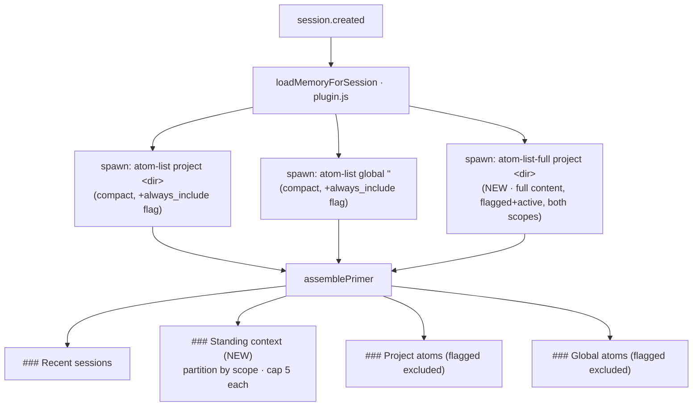

# Design — atom-always-include

## Context

The session primer (`assemblePrimer` in `src/lib/signal-utils.js`) renders the
atom corpus as a **compact directory**: two scope sections (`### Project atoms`,
`### Global atoms`), each atom on one line — `topic [time] — "description" —
80-char-preview…`. To read an atom's full text an agent must issue a separate
`memory_atom_get` call. For a small set of high-value atoms read on almost every
session (project conventions, user preferences, standing checklists) this extra
fetch is friction and a forgetting-risk.

This change adds an `always_include` boolean flag. Flagged atoms render their
**complete content** as a full Markdown block in a new `### Standing context`
section placed **after `### Recent sessions` and before `### Project atoms`**, so
the agent reads them with no fetch. Flagged atoms are removed from the compact
directory (they already appear in full). Each scope is capped at **5** rendered
blocks; overflow atoms are named in a compact note.

Established facts this design builds on:

- **Storage / access model.** SQLite (`memory_atom`, `UNIQUE(scope, project,
  topic)`, external-content FTS5 kept in sync by triggers `memory_atom_ai/ad/au`).
  `src/memory.js` is the **sole writer**; the plugin never opens the DB — it
  shells out to the CLI via `$`. Every subprocess spawn is a process fork.
- **Schema versioning.** Each column addition is a `PRAGMA user_version`-gated
  phase. Current version is **v5**; this change is **v6**. The pattern is: gate on
  `user_version < N` + a `PRAGMA table_info` column-existence probe →
  `ALTER TABLE ADD COLUMN` → stamp `user_version = N`, with the fresh-DB baseline
  `CREATE TABLE` carrying the new column so fresh and migrated DBs are identical.
- **`pinned` is the direct precedent.** It is an `INTEGER NOT NULL DEFAULT 0`
  boolean, INSERT-only on `atomWrite`, toggled via `atomPatch`, surfaced as a
  column by `atomList` (not FTS-indexed), and its render cap is enforced in
  `assemblePrimer`, not in SQL. This change mirrors that precedent throughout.
- **`atomList` is summary-only by contract.** It returns `substr(content,1,80) AS
  preview`, deliberately **not** full content, and it backs **two** consumers:
  the primer injector *and* the `memory_atom_list` plugin tool. Keeping it
  summary-only is a hard requirement of this change.
- **Cap precedent.** The existing 40-cap is enforced in `assemblePrimer`
  (`slice(0, cap)` + a `(+N more)` note); the query returns all rows. This design
  follows the same "query returns all, cap at render" placement.

This is a set of **extensions to existing capabilities** (`memory-atom`,
`signal-processing`, `memory-atom-tools`). No new capability; no breaking change —
everything defaults to the pre-change behaviour (`always_include = 0`).

## Goals / Non-Goals

**Goals**

- Let an agent flag an atom so its **full content** appears in every session
  primer without a `memory_atom_get` call.
- Render flagged atoms in a dedicated `### Standing context` section between
  `### Recent sessions` and `### Project atoms`; omit the section entirely when no
  flagged active atoms exist.
- Cap rendering at **5 per scope** (workspace and global independently); render
  the 5 most-recently-updated in full, name the remainder in a compact note.
- Exclude flagged atoms from the compact directory (no double-render).
- Keep `atomList` — and therefore the `memory_atom_list` tool — **contract-stable
  and summary-only**; deliver full content by a separate path.
- Keep fresh-install and migrated databases schema-identical.

**Non-Goals**

- **No write-time cap.** The 5-cap is a render policy, not a write rejection; an
  agent may flag any number of atoms (Decision D6).
- **`always_include` is not searchable.** It is a filter/sort column, excluded
  from the FTS index and its sync triggers (mirrors `pinned`).
- **No per-atom truncation.** Rendered blocks show content verbatim, in full.
- **Cap value not configurable.** 5 is a named constant, not a config knob
  (YAGNI; revisit only if a real need appears).
- No implementation here — this is the design; the engineer implements and
  authors the delta specs.

## Data flow



## Decisions

### D1 — Store `always_include` as `INTEGER NOT NULL DEFAULT 0`

SQLite's canonical boolean idiom — `0`/`1`, default `0`, mirroring `pinned`.
`NOT NULL DEFAULT 0` guarantees migrated rows and omitted-value inserts are
un-flagged with no nullable tri-state.

- **Alternative — reserved tag (`tags: ["always-include"]`):** rejected for the
  same reasons `pinned` rejected it — hidden convention, typo-prone free string,
  FTS pollution (tags are indexed), and per-row JSON parsing to filter. A typed
  column is self-describing and cheaply filterable.

### D2 — Content-fetch strategy: a new `atomListFull` query (Option 3)

**Recommended.** Add a dedicated DB helper `atomListFull` (`src/lib/schema.js`)
and CLI subcommand `atom-list-full` (`src/memory.js`) that returns **full
content** for `always_include = 1 AND status = 'active'` atoms in the current
workspace **and** global scope, in a single query, carrying `scope`, `topic`,
`description`, `content`, `updated_at`. `atomList` is left byte-for-byte
unchanged except for exposing the boolean flag (D5). `assemblePrimer` receives
the result as one new `standingAtoms` parameter and partitions it by `scope`.

Query shape (one pass, both scopes, no per-atom fork; ordered so the cap
selection in D6 is deterministic):

```sql
SELECT scope, project, topic, description, content, updated_at
FROM memory_atom
WHERE always_include = 1
  AND status = 'active'
  AND ((scope = ? AND project = ?) OR (scope = 'global' AND project = ''))
ORDER BY updated_at DESC, topic
```

Rationale:

- **Contract-stable.** `atomList` and the `memory_atom_list` tool never carry
  full content — the change's explicit goal. Full content flows through a
  purpose-built path with a distinct consumer (the injector).
- **One query pass, bounded cost.** A single extra subprocess spawn at session
  start returns both scopes; no per-atom work.
- **No pre-existing global-in-project duplication.** Unlike `atomList`'s project
  query (which the compact sections must post-filter to keep globals out), this
  query tags every row with `scope`, so `assemblePrimer` partitions cleanly and
  a global flagged atom appears in exactly one group.
- **Mirrors an existing shape.** `atomListFull` is a near-clone of `atomList`,
  small and familiar.

**Alternatives considered**

- **Option 1 — `atomList` returns `CASE WHEN always_include=1 THEN content END AS
  full_content`.** Simplest (one SELECT edit, zero new spawns/subcommands) and,
  absent the contract requirement, the YAGNI choice. **Rejected** because
  `atomList` backs the `memory_atom_list` tool as well as the injector: the tool
  would receive full atom bodies in its CLI stdout that it never renders — payload
  bloat and a break of the documented "summary-only" contract, inherited by any
  future consumer. The reviewer flagged exactly this. The stated goal makes
  contract-stability a hard constraint, so the marginal extra surface of Option 3
  is justified.
- **Option 2 — one `atom-get` per flagged atom.** **Rejected** on fork cost: the
  plugin reaches the DB only by spawning `node memory.js`. Up to 10 flagged atoms
  (5 + 5) would mean up to 10 extra process forks at every session start, plus
  `atomGet`'s irrelevant priority-resolution / `alsoIn` work. Option 3 does the
  same job in one spawn.

### D3 — New `### Standing context` section, placed between Recent sessions and Project atoms

`assemblePrimer` renders the section from `standingAtoms`, after the Recent
sessions block and before the compact Project atoms directory. Heading is exactly
`### Standing context` (matches the proposal's Modified Capabilities text).

Per-atom block format (verbatim, `####` under the `###` section, blank line
between atoms):

```
### Standing context

These atoms are shown in full — no memory_atom_get needed.

#### conventions/coding [2h ago]
*"Project coding conventions"*

<full atom content verbatim>

#### prefs/user [yesterday]
*"User preferences"*

<full atom content verbatim>
```

- Within the section, the **workspace** group (rows where `scope='project'`)
  renders first, then the **global** group (`scope='global'`). No sub-headings —
  each block is self-describing; the groups matter only for independent capping
  (D6).
- **Section omission.** If neither scope has an active flagged atom, the whole
  `### Standing context` heading and intro line are omitted (no empty section).

### D4 — Flagged atoms are excluded from the compact directory

Before the existing pinned/regular partition, `assemblePrimer` filters
`always_include`-truthy atoms **out** of `activeProjectAtoms` and
`activeGlobalAtoms`. A flagged atom therefore appears **once**, as a full block in
Standing context, and never as a compact line. The `(+N more)` overflow count for
the compact sections is computed from the already-filtered (non-flagged) sets, so
flagged atoms do not consume the 40-cap.

This is why `atomList` must still surface the boolean flag (D5): the compact
sections need it to exclude, even though they never need the content.

- **`always_include` supersedes `pinned` for placement.** An atom that is both
  pinned and flagged renders as a full Standing-context block and does **not**
  also appear in the compact pinned group — full block wins, no double-render.

### D5 — `atomList` exposes the flag as a boolean column only (no content)

`atomList`'s SELECT adds `always_include` to its explicit column list in **both**
the `scope='all'` and default branches — exactly as `pinned` was added. This is a
`0`/`1` flag, **not** content, so the summary-only contract is preserved. Full
content is never returned by `atomList`; it comes solely from `atomListFull` (D2).

### D6 — 5-per-scope cap enforced in `assemblePrimer`, selection by `updated_at`, render by `topic`

The cap is a **render-time** policy in `assemblePrimer`, consistent with the
existing 40-cap placement. `atomListFull` applies no `LIMIT`; `assemblePrimer`,
per scope group independently:

1. **Select** — sort the group by `updated_at DESC` and take the first **5**.
2. **Render** — sort those ≤5 by `topic` (alphabetical) and emit full blocks.
3. **Overflow** — if the group held more than 5, emit one compact note naming the
   remaining topics (alphabetical), e.g.:
   `(+2 more standing atoms exceed the 5-per-scope cap — fetch with memory_atom_get: docs/runbook, ops/oncall)`

Placing the cap here (not in SQL, not at write) keeps the policy in one place,
preserves the overflow count and topic list for the note, and matches how the
40-cap already works.

- **Alternative — `LIMIT 5` in the query:** rejected; the query would then not
  know the total, so `assemblePrimer` could neither show `(+N more)` nor name the
  overflow topics.
- **Alternative — reject the 6th flag at write time:** rejected; the proposal
  specifies a graceful render policy, not a write error. A write-time cap is also
  a costly per-scope global constraint to enforce on every `atomWrite`/`atomPatch`
  and races under concurrency.
- Define the cap as a named constant `MAX_STANDING_ATOMS = 5` in
  `src/lib/signal-utils.js` (alongside `MAX_SIGNALS_PER_KIND`).

### D7 — `always_include` is INSERT-only in `atomWrite`; toggled only via `atomPatch`

`atomWrite` places `always_include` in the **INSERT column list** (default `0`)
but **not** in the `ON CONFLICT … DO UPDATE SET` clause. On first creation the
caller's value is written; every subsequent content re-write to the same topic
preserves the existing flag untouched — identical to `pinned` (safe default that
prevents a content update from silently clearing the flag).

`atomPatch` gains `always_include` in its `PATCHABLE` set, coerced to `0`/`1`,
distinguishing explicit `false` (clear) from omitted (leave unchanged) via the
existing `'always_include' in patch` machinery. A flag change **bumps
`updated_at`** (consistent with `pinned`/`status`/`description`; and it is
honest recency that also affects the cap selection in D6 and the block's relative
time).

### D8 — Fresh-DB baseline and v6 migration must converge

Two edits to `ensureSchema` that must agree:

1. **Phase 1 baseline** — add `always_include INTEGER NOT NULL DEFAULT 0` to the
   `CREATE TABLE IF NOT EXISTS memory_atom (…)` column list, so a fresh DB is born
   with the column.
2. **Phase 6 v6 migration** — a new block mirroring the v3/v4 pattern: gate on
   `PRAGMA user_version < 6`, probe `PRAGMA table_info(memory_atom)` for the
   absence of `always_include`, run `ALTER TABLE memory_atom ADD COLUMN
   always_include INTEGER NOT NULL DEFAULT 0`, then stamp `PRAGMA user_version = 6`.
   Re-run safe: if the column is already present, skip the ALTER and only advance
   the version marker.

Both paths must yield an identical schema. **FTS is untouched** — `always_include`
is a filter column, not indexed, so the FTS5 virtual table and the
`memory_atom_ai/ad/au` triggers are not modified (mirrors `pinned`).

### D9 — Plugin tool surface

- `memory_atom_write` args gain optional `always_include: boolean` (default
  `false`) with an INSERT-only caveat: "set on first creation; a re-write never
  changes it — use `memory_atom_patch` to toggle."
- `memory_atom_patch`'s `patch` sub-object gains optional `always_include:
  boolean` — the sole post-creation toggle path.
- `loadMemoryForSession` adds one `atom-list-full` spawn and passes the result as
  `standingAtoms` to `assemblePrimer`.
- **`[always-include]` marker in `atom-list` output (minor parity add).** Since
  `atomList` now returns the flag (D5), the `memory_atom_list` tool formatter may
  render an `[always-include]` marker next to `[pinned]`, for discoverability at
  low cost. Recommended but non-essential; the engineer may include it with the
  other formatter markers.

### D10 — MEMORY_PROTOCOL updated

The `MEMORY_PROTOCOL` constant in `src/plugin.js` gains guidance on when to use
`always_include` (and its misuse warning / distinction from `pinned`). The
wording is drafted in the proposal (`proposal.md`, "MEMORY_PROTOCOL draft
(proposed)") — the engineer transcribes it. No design decision beyond "the
constant is updated."

## Risks / Trade-offs

**(a) Over-fetch beyond the cap.** `atomListFull` pulls full content for *all*
active flagged atoms in scope, but only ≤5 per scope render; content for overflow
atoms is fetched and discarded. Bounded by operator discipline ("use sparingly")
and the rarity of the flag. Accepted. A window-function query that returns full
content only for the top-5 and previews for the rest is possible but pushes the
cap policy into SQL, splitting it from the 40-cap's render-time home — deferred as
YAGNI.

**(b) Context-window pressure.** Five full atoms per scope (up to ten total) plus
their content are injected into every primer for the scope. This is the feature's
intent, but large flagged atoms inflate every session start. Mitigation is the
MEMORY_PROTOCOL's "under ~500 words / use sparingly" guidance and operator
discipline, not enforcement. Accepted trade-off.

**(c) INSERT-only flag means `memory_atom_write` cannot clear it.** A re-write of
a flagged atom preserves the flag (D7); clearing requires an explicit
`memory_atom_patch(always_include=false)`. Deliberate safe-default (prevents
accidental clearing); a small ergonomic cost, stated in the `memory_atom_write`
tool description.

**(d) Schema-divergence if D8 is done by halves.** Editing only the migration or
only the baseline produces fresh-vs-migrated drift. The paired edit plus the
column-existence probe are the guard; the delta spec and tests must assert both
paths converge (the exact bug the v2 pattern guards against).

**(e) Null-guard regressions.** Two early-return guards must learn about standing
atoms, or a corpus consisting *only* of flagged atoms would suppress the primer:

- `assemblePrimer`'s `return null` guard must also consider `standingAtoms`
  (return `null` only when rows **and** compact project **and** compact global
  **and** standing are all empty).
- The injector's cold-start guard already passes, because `atomList` still returns
  flagged atoms (with the flag, minus content), so `projectAtoms`/`globalAtoms`
  are non-empty even when every atom is flagged. No change needed there, but the
  test suite must cover the "all atoms flagged" case.

## Migration Plan

**Schema v5 → v6 (existing databases):**

1. On next CLI invocation `ensureSchema` runs; Phase 1 `CREATE TABLE IF NOT
   EXISTS` is a no-op for the existing table.
2. v6 block: `PRAGMA user_version` returns `5` (`< 6`); probe
   `table_info(memory_atom)` — `always_include` absent → `ALTER TABLE … ADD COLUMN
   always_include INTEGER NOT NULL DEFAULT 0`. All existing rows become `0`
   (un-flagged) — behaviour identical to pre-change.
3. Stamp `PRAGMA user_version = 6`.
4. Re-run safe: column-present branch skips the ALTER and only advances the marker
   (mirrors the v3/v4 probe branches).
5. FTS index and triggers untouched — no rebuild.

**Fresh install:** Phase 1 baseline already carries `always_include`; the v6 gate
just stamps `user_version = 6`. Schema is identical to a migrated DB.

**Ordering:** the v6 block follows v5, each independently gated by its own
`user_version` threshold and shape probe, so a DB at any prior version walks the
ladder in order.

**Rollback:** additive and backward-compatible. An older CLI opening a v6 DB
ignores the unknown column (its SELECTs name columns explicitly). No content
migration; only a column add with a safe default — data-loss risk nil. SQLite
`DROP COLUMN` is not required; the unused column is inert. Document "no automated
downgrade; the column is harmless if unused."

## Open Questions

1. **Intro line wording for `### Standing context`.** D3 proposes "These atoms are
   shown in full — no memory_atom_get needed." Confirm the exact phrasing (or drop
   the intro entirely) before the engineer locks the delta spec — cosmetic, low
   risk.
2. **`[always-include]` marker in `atom-list` (D9).** Recommended for parity with
   `[pinned]`, but strictly optional; confirm whether to include it now or defer.

## Component Breakdown

Each part states *what* it is, the *kind* of work, and its *done-criterion*. No
implementing agent is assigned; the engineer implements all parts.

1. **Schema column + v6 migration** — `src/lib/schema.js`, `ensureSchema`.
   Application/DB code. Done when: Phase 1 baseline `CREATE TABLE` includes
   `always_include INTEGER NOT NULL DEFAULT 0`; a v6 block gated by
   `user_version < 6` + `table_info` probe runs the ALTER and stamps
   `user_version = 6`; FTS untouched; fresh and migrated DBs schema-identical.

2. **`atomWrite` INSERT-only flag** — `src/lib/schema.js`, `atomWrite`.
   Application code. Done when: `always_include` is in the INSERT column list
   (default `0`) and **absent** from `ON CONFLICT … DO UPDATE SET`; a re-write
   provably preserves an existing flag.

3. **`atomPatch` flag support** — `src/lib/schema.js`, `atomPatch`. Application
   code. Done when: `always_include` is in `PATCHABLE`, coerced to `0`/`1`,
   distinguishes explicit `false` from omitted, and bumps `updated_at` on change.

4. **`atomList` flag column** — `src/lib/schema.js`, `atomList`. Application code.
   Done when: `always_include` is added to the explicit column list in **both**
   branches; **no** full content is returned (summary contract intact).

5. **`atomListFull` query** — `src/lib/schema.js` (new helper). Application/DB
   code. Done when: it returns `scope, project, topic, description, content,
   updated_at` for `always_include=1 AND status='active'` across current
   workspace + global in one query, ordered `updated_at DESC, topic`; no `LIMIT`.

6. **CLI `atom-list-full` + write/patch plumbing** — `src/memory.js`. Application
   code. Done when: a new `atom-list-full <scope> <project>` subcommand invokes
   `atomListFull` and prints JSON; `cmdAtomWrite` forwards `always_include` on
   create; `cmdAtomPatch` accepts `always_include` in its patch object; `atom-list`
   output carries the flag through.

7. **Primer standing-context render** — `src/lib/signal-utils.js`,
   `assemblePrimer` (+ `MAX_STANDING_ATOMS = 5`; optional `renderAtomBlock`
   helper). Application code. Done when: a `standingAtoms` param is accepted and
   partitioned by scope; each scope caps at 5 (select by `updated_at DESC`, render
   by `topic`) with an overflow note naming remaining topics; the `###
   Standing context` section sits between Recent sessions and Project atoms and is
   omitted when empty; flagged atoms are excluded from the compact sections and
   from the 40-cap; the `return null` guard accounts for standing atoms.

8. **Injector fetch** — `src/plugin.js`, `loadMemoryForSession`. Application code.
   Done when: one `atom-list-full` spawn is added and its result passed as
   `standingAtoms` to `assemblePrimer`, with the same try/catch degradation as the
   existing `atom-list` calls.

9. **Plugin tool schemas + MEMORY_PROTOCOL** — `src/plugin.js`. Application code.
   Done when: `memory_atom_write` args gain optional `always_include: boolean`
   (INSERT-only caveat); `memory_atom_patch`'s `patch` gains optional
   `always_include: boolean`; MEMORY_PROTOCOL is updated from the proposal draft;
   (optional) the `atom-list` formatter renders an `[always-include]` marker.

10. **Delta specs** — `openspec/changes/atom-always-include/specs/…` for
    `memory-atom`, `signal-processing`, `memory-atom-tools`. Spec authoring
    (engineer-owned). Done when: the three modified capabilities capture the new
    requirements transcribed from this design.

11. **Tests** — `test/`. Application/test code. Done when: schema convergence
    (fresh vs migrated, FTS untouched), INSERT-only preservation, patch
    toggle/clear, `atomList` flag-without-content, `atomListFull` scope
    partitioning and status filter, primer standing-context render (cap selection
    by `updated_at`, render order by `topic`, overflow note, exclusion from
    compact + 40-cap, all-atoms-flagged still renders, empty-section omission),
    and the tool schema additions are covered.
