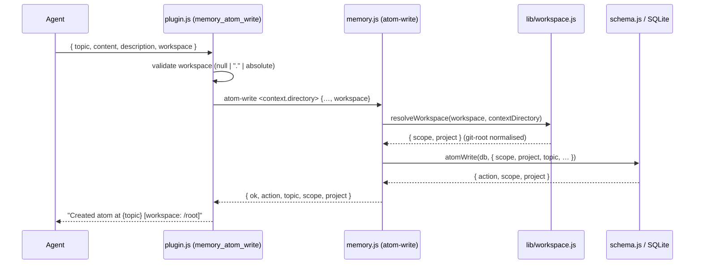
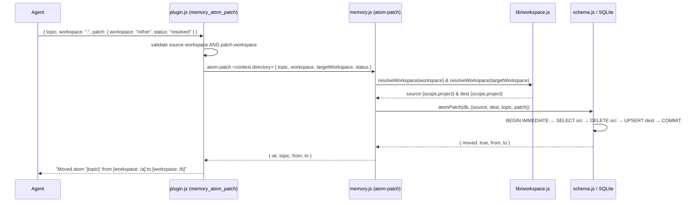

# Design — memory-api-explicit-scope-and-keyword-search

## Overview

This change replaces the ambiguous `scope` parameter on the four write/mutate memory
tools with an explicit, required `workspace` addressing model (`null` = global, `"."` =
current git root, absolute path = foreign git root), where every supplied path is
canonicalised to its nearest `.git`-directory root before it reaches the database. It
adds atomic cross-workspace moves to `memory_atom_patch`, a `memory_workspaces_list`
discovery tool, a resolved-location suffix on every write/mutate confirmation, and
renames `memory_atom_search`'s `query` parameter to `keywords` to stop agents treating
keyword FTS as semantic search. Resolution is centralised in the `memory.js` CLI layer
(the sole DB writer) so no unresolved or non-normalised path can ever be stored.

## Components

### 1. Addressing model & `resolveWorkspace`

The four write/mutate tools — `memory_atom_write`, `memory_atom_append`,
`memory_atom_patch`, `memory_atom_delete` — drop `scope` and gain a **required**
`workspace` parameter. The read tools (`memory_atom_get`, `memory_atom_list`,
`memory_atom_search`) keep their existing `scope` filter parameter unchanged.

`workspace` accepts exactly three logical forms:

| Value            | Meaning                          | Resolves to                          |
|------------------|----------------------------------|--------------------------------------|
| `null`           | global store                     | `{ scope: 'global', project: '' }`   |
| `"."`            | current project                  | git root of `context.directory`      |
| `"/abs/path"`    | foreign project                  | git root of `/abs/path`              |

**Placement (per proposal Impact §):** resolution lives in the CLI subprocess so the DB
always receives a resolved path. Implement the pure functions in a new
`src/lib/workspace.js` module (unit-testable without spawning) and call them from
`src/memory.js`:

```
resolveWorkspace(workspace, contextDirectory) → { scope, project }
findGitRoot(startAbsolutePath) → string   // resolved root, or startAbsolutePath as-is
```

`resolveWorkspace` algorithm:

1. `workspace === null` → return `{ scope: 'global', project: '' }`.
2. `workspace === '.'` → `expanded = path.resolve(contextDirectory)`.
   `"."` must never reach `findGitRoot` or the DB.
3. otherwise `expanded = path.resolve(workspace)` (already absolute; `path.resolve`
   normalises `..`/trailing-slash).
4. `root = findGitRoot(expanded)`; return `{ scope: 'project', project: root }`.

`findGitRoot(start)` walk-up, using `node:fs` only (no `git` binary dependency — this is
why a manual walk is chosen over `git rev-parse`; it degrades gracefully when git is
absent):

- For each directory `dir` from `start` upward:
  - `stat` `join(dir, '.git')`:
    - is a **directory** → return `dir` (stop — main repo root found).
    - is a **file** → worktree pointer; skip and continue to `dirname(dir)`.
    - does not exist (`ENOENT`) → continue to `dirname(dir)`.
  - When `dirname(dir) === dir` (filesystem root reached) → return `start` unchanged
    (graceful fallback for non-git projects).
- A non-existent `start` is fine: the walk still ascends real ancestors, so
  `/repo/gone-subdir` resolves to `/repo` when `/repo/.git` exists, and falls back to
  `/repo/gone-subdir` only if no ancestor has a `.git` directory (see D2c).

> Worktree note: skipping `.git` **files** collapses worktrees nested *inside* the main
> tree to the main root. A worktree checked out *outside* the main tree walks to the
> filesystem root and falls back to its own path — the manual walk cannot follow the
> `gitdir:` pointer without parsing it, which is deliberately out of scope here.

**Read-tool consistency (follow-up, per proposal §Modified `scope` filter line):** the
`workspace` *targeting* parameter on `memory_atom_get` currently substitutes
`context.directory` and is not git-root normalised, so a foreign read at a sub-path will
miss an atom a foreign write stored at the git root. The shared `src/lib/workspace.js`
functions make aligning it cheap (normalise the `workspace` targeting arg before
`resolveScope`). It is **not** in this change's write/mutate component set; flag it for
the engineer to fold in or track separately.

### 2. CLI transport contract

Because resolution moves into `memory.js`, the four write/mutate subcommands change from
`<scope> <project>` positionals to a single `<contextDirectory>` positional plus the
`workspace` value **carried inside the JSON payload**. This is preferred over a
positional workspace token because JSON carries `null` natively (no string sentinel for
"global"), and it lets the move destination (`targetWorkspace`) travel the same way — see
D1.

| Subcommand      | New CLI shape                                  | JSON keys added                        |
|-----------------|------------------------------------------------|----------------------------------------|
| `atom-write`    | `atom-write <contextDirectory> <json>`         | `workspace`                            |
| `atom-append`   | `atom-append <contextDirectory> <json>`        | `workspace`                            |
| `atom-delete`   | `atom-delete <contextDirectory> <json>`        | `workspace`, `topic` (now JSON, not positional) |
| `atom-patch`    | `atom-patch <contextDirectory> <json>`         | `workspace` (source), `targetWorkspace` (optional, move) |

Read subcommands are **unchanged**: `atom-get <scope> <project> <topic>`,
`atom-list <scope> <project> [<prefix>] [<optionsJson>]`,
`atom-search <scope> <project> <json>` (still resolved in plugin.js via `resolveScope`).

`plugin.js` responsibilities per write/mutate tool:

1. Validate `workspace` type: must be `null` or a string; else return a validation error
   as tool output (D2a) — do **not** spawn.
2. If a string, it must be `"."` or `path.isAbsolute(workspace)`; else validation error
   (D2b).
3. Embed `workspace` in the JSON payload and spawn with `context.directory` as the sole
   locator positional.

`memory.js` per subcommand: parse JSON, call `resolveWorkspace(json.workspace,
contextDirectory)`, then run the existing schema helper with the resolved
`{ scope, project }`.

### 3. `memory_atom_patch` move semantics

`memory_atom_patch` distinguishes two locators:

- top-level `workspace` (required) → **source** locator (where the atom currently lives).
- `patch.workspace` (optional) → **destination**; its presence triggers an atomic move.

`plugin.js` maps `patch.workspace` to the JSON key `targetWorkspace` and does **not**
place it in the metadata set-clause list. `memory.js` resolves both locators with
`resolveWorkspace(..., contextDirectory)`.

Move executes in `schema.js` `atomPatch` (extended) under one transaction:

```
BEGIN IMMEDIATE
  SELECT full source row  WHERE (sourceScope, sourceProject, topic)   -- error if absent
  -- apply any present metadata patch fields to the in-memory row
  DELETE                  WHERE (sourceScope, sourceProject, topic)
  INSERT/UPSERT at (destScope, destProject, topic)   -- ON CONFLICT DO UPDATE (overwrite)
COMMIT
```

Rules:

- **All fields preserved**: `description, content, tags, pinned, always_include, status,
  session_id, session_name, created_at`. `updated_at` is bumped to `now()` (a move is a
  mutation). A new autoincrement `id` is assigned by the INSERT.
- **Combined move + metadata** is allowed: metadata fields present alongside
  `patch.workspace` are applied to the row before it lands at the destination.
- **Destination conflict → overwrite**, consistent with write-upsert semantics
  (`ON CONFLICT(scope, project, topic) DO UPDATE`).
- **Source == destination** (resolved locators equal) → treat as a normal in-place patch;
  do not DELETE/re-INSERT.
- FTS stays in sync automatically: the DELETE fires `memory_atom_ad` and the INSERT fires
  `memory_atom_ai`.

Non-move patch (no `targetWorkspace`) is the existing metadata-only path, unchanged apart
from the source locator now arriving via `workspace`/`resolveWorkspace`.

### 4. `atomListWorkspaces` + `memory_workspaces_list` + `atom-list-workspaces`

New DB helper exported from `schema.js`:

```
atomListWorkspaces(db, { includeDeprecated }) → [{ workspace: string, count: number }]
```

```sql
SELECT project AS workspace, COUNT(*) AS count
FROM memory_atom
WHERE scope = 'project'                    -- global atoms excluded
  AND project != ''                        -- defensive: skip empty keys
  {AND status != 'deprecated'}             -- omitted when includeDeprecated is true
GROUP BY project
ORDER BY count DESC
```

New CLI subcommand `atom-list-workspaces [<optionsJson>]` where `optionsJson` is
`{ includeDeprecated? }`; prints the JSON array to stdout.

New tool `memory_workspaces_list` (naming per `memory_<noun>_<verb>`):

- args: `{ includeDeprecated?: boolean }`.
- spawns `atom-list-workspaces`, formats each row as `• {workspace} — {count} atom(s)`.
- empty result → `No workspaces with stored atoms.`

### 5. Write/mutate output location suffix

Every write/mutate confirmation ends with the resolved location. `memory.js` returns the
resolved `{ scope, project }` in each result JSON; `plugin.js` owns formatting via a
helper:

```
formatLocation(scope, project) → scope === 'global' ? '[global]' : `[workspace: ${project}]`
```

Confirmation strings:

- write (created):     `Created atom at {topic} [workspace: /git/root]` / `… [global]`
- write (overwritten): `Updated existing atom at {topic} (previous content overwritten) [workspace: /git/root]`
- append:              `{existing append confirmation} [workspace: /git/root]`
- delete:              `Deleted atom '{topic}' ({n} row removed) [workspace: /git/root]`
- patch (metadata):    `Patched atom '{topic}' ({fields}) [workspace: /git/root]`
- patch (move):        `Moved atom '{topic}' from [workspace: /old] to [workspace: /new]`

For the move, `memory.js` returns both `from` and `to` locations; `plugin.js` renders the
`moved from … to …` form.

### 6. `memory_atom_search` `query` → `keywords`

Rename the parameter end-to-end; the FTS `MATCH ?` query itself is unchanged:

- `plugin.js` tool arg `query` → `keywords`; execute destructures `keywords`.
- JSON sent to `atom-search` uses key `keywords`.
- `memory.js` `cmdAtomSearch` reads `data.keywords`.
- `schema.js` `atomSearch({ …, keywords })` binds `keywords` into the existing `MATCH`/
  `LIKE` clauses.
- Description rewritten to state **keyword FTS (BM25 token matching), NOT semantic/vector
  search**.

### 7. Migration procedure (prose, no new tool)

A `/migrate-workspace-atoms` procedure is added as prose in the `MEMORY_PROTOCOL` header
comment (plugin.js ~lines 66–90). Full specification in [§Migration](#migration).

## Data Flow

### Write



### Move (`memory_atom_patch` with `patch.workspace`)



### List workspaces

```
Agent → memory_workspaces_list { includeDeprecated? }
      → plugin.js spawns: atom-list-workspaces [ {includeDeprecated} ]
      → memory.js → atomListWorkspaces(db, { includeDeprecated })
      → SELECT project, COUNT(*) … GROUP BY project ORDER BY count DESC
      ← [{ workspace, count }, …]
      ← "• /repo-a — 12 atom(s)\n• /repo-b — 3 atom(s)"
```

## Error Handling

| Case | Where caught | Behaviour |
|------|--------------|-----------|
| `workspace` non-null, non-string (D2a) | plugin.js, pre-spawn | validation error returned as tool output; no spawn |
| `workspace` relative string other than `"."` (D2b) | plugin.js, pre-spawn | validation error returned as tool output; no spawn |
| `workspace` omitted (now required) | plugin.js schema | tool schema rejects the call (required param) |
| `patch.workspace` non-null, non-string, or bad relative | plugin.js, pre-spawn | validation error returned as tool output |
| Path does not exist during git-root walk (D2c) | `findGitRoot` | not an error — ascend real ancestors; fall back to `expanded` as-is if no `.git` dir found |
| Non-git project (root reached, no `.git` dir) | `findGitRoot` | return `expanded` path as-is (`scope: 'project'`) |
| Move: source atom not found | `schema.js` `atomPatch` | throw → `memory.js` exit(1) → plugin.js catch → `Error patching atom: Atom '{topic}' does not exist` |
| Patch with empty `patch` (no fields, no move) | plugin.js + schema.js | `Error: at least one of description, tags, created_at, pinned, always_include, status is required` |
| Invalid `status` value | plugin.js + schema.js | `Error: status must be one of: active, resolved, deprecated` |
| `atom-search` called with legacy `query` name | plugin.js schema | unknown-arg / missing-`keywords` error (BREAKING, intended) |
| FTS5 unavailable | `schema.js` `atomSearch` | existing graceful `LIKE` fallback, unchanged |

Notes:

- D2a/D2b are validated in **plugin.js before spawning** so the agent gets a clean,
  actionable message (not a subprocess stderr echo).
- `resolveWorkspace` in `memory.js` still guards defensively (throws on a relative,
  non-`"."` value that slips through); such a throw surfaces via the existing
  `spawnMemory` reject → tool-output catch path.
- All existing per-command `try/catch` and `BEGIN IMMEDIATE`/`ROLLBACK` wrappers are
  retained; the move reuses that pattern.

## Migration

`/migrate-workspace-atoms` is an **agent-driven prose procedure** added to the
`MEMORY_PROTOCOL` header comment — no new tool, no automatic data migration (paths stored
before git-root normalisation are re-keyed only when an agent runs the procedure).

Procedure text (spec):

1. Call `memory_workspaces_list` to enumerate every stored workspace path with atom
   counts.
2. For each listed path, determine its git root:
   `git -C <path> rev-parse --show-toplevel`.
   - If the command fails (not a git repo) → leave the workspace unchanged.
3. If `path` ≠ git root, the atoms are stored under a legacy sub-path. For each atom in
   that workspace (enumerate via `memory_atom_list` with `scope`/targeting for that
   path), call `memory_atom_patch` with:
   - top-level `workspace` = the legacy `path` (source),
   - `patch.workspace` = the resolved git root (destination),
   which atomically moves each atom to the normalised key.
4. Re-run `memory_workspaces_list` to confirm only git-root paths remain.

The procedure is idempotent: paths already equal to their git root are skipped in step 3;
moving an atom already at its git root is a source==destination no-op (§Component 3).

> The migration uses `git rev-parse --show-toplevel` on the agent side for discovery,
> while the actual `memory_atom_patch` write re-normalises the destination through
> `resolveWorkspace` in `memory.js` — defence in depth against an agent supplying an
> unnormalised destination.

## Decisions

### D1 — CLI arg shape for `atom-patch` move (and all write/mutate transport)

**Options.**
(A) Keep `<scope> <project>` positionals resolved in plugin.js; carry only
`targetWorkspace` in JSON. (B) Carry the source `workspace` (and `targetWorkspace`) inside
the JSON payload, pass `<contextDirectory>` as the sole locator positional, resolve both
in `memory.js`.

**Decision: B.** The proposal places `resolveWorkspace` in `memory.js` so the DB always
receives resolved paths; B honours that and makes source and destination symmetric (both
JSON keys, both resolved by the sole writer). B also lets `null` (global) travel as native
JSON `null`, eliminating the string-sentinel encoding a positional workspace token would
need — removing an entire class of transport bugs. Cost: `atom-delete` moves its `topic`
into a small JSON payload and the four subcommands change positional shape. That churn is
justified by a single resolution site and native-null transport. The move destination is
the JSON key `targetWorkspace` (mapped from the tool's `patch.workspace`).

### D2 — `resolveWorkspace` error cases

**(a)** `workspace` non-null/non-string → validation error returned as **tool output**
(plugin.js, pre-spawn), not thrown.
**(b)** `workspace` is a relative path other than `"."` → validation error as tool output;
only `"."` and absolute paths are accepted. Checked in plugin.js (pure string inspection)
for a clean message; `resolveWorkspace` guards defensively too.
**(c)** Path does not exist during the git-root walk → **not** an error: `findGitRoot`
ascends real ancestors and, if none has a `.git` directory, returns the expanded path
as-is (same as the no-git fallback). Rationale: a foreign workspace may exist in the DB
even when it is not currently present on disk, so writes/moves/queries against it must not
fail on a missing filesystem path.

### D3 — Transaction isolation for the move

`BEGIN IMMEDIATE` is correct and sufficient. `memory.js` is the **sole writer**, so there
is no write contention; `IMMEDIATE` acquires the write lock up front (preventing a
reader-to-writer upgrade deadlock mid-transaction) which is all that is required. The move
reuses the exact pattern already used by `atomAppend`/`atomPatch`.

### D4 — `"."` in `memory_atom_patch` top-level `workspace`

The same expansion rule applies to the top-level `workspace`: `"."` → `context.directory`
→ git root. The two locators are distinct and must be documented explicitly:

- **top-level `workspace`** = the atom's current location (**source**).
- **`patch.workspace`** = where to move it (**destination**); its presence is the sole
  move trigger.

Both resolve through the identical `resolveWorkspace(value, contextDirectory)` path, so
`"."`, `null`, and absolute paths behave consistently for source and destination alike.

### D5 — `memory_atom_delete` `workspace`

`workspace` on `memory_atom_delete` is a **targeting/filter** parameter (the same model as
the patch source locator), resolved via `resolveWorkspace`. It selects which stored
workspace the topic is deleted from; it does not move or copy anything. It is required and
follows the null/`"."`/absolute rules and the git-root normalisation identically.
